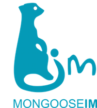

# MongooseIM platform

* [Getting started](https://esl.github.io/MongooseDocs/latest/user-guide/Getting-started/)
* [Developer's guide](https://esl.github.io/MongooseDocs/latest/developers-guide/Testing-MongooseIM/)
* [Packages](https://www.erlang-solutions.com/resources/download.html)
* Product page: [https://www.erlang-solutions.com/products/mongooseim.html](https://www.erlang-solutions.com/products/mongooseim.html)
* Documentation: [https://esl.github.io/MongooseDocs/](https://esl.github.io/MongooseDocs/)

## Get to know MongooseIM
MongooseIM is a robust and efficient chat (or instant messaging) platform aimed at large installations.

Designed for enterprise, it is fault-tolerant, can utilise the resources of multiple clustered machines, and easily scales for more capacity by simply adding a box or VM.

MongooseIM can accept client sessions over vanilla XMPP, REST API and SSE, as well as Websockets, and BOSH (HTTP long-polling).

As a platform, MongooseIM includes several server-side (backend) and client-side (frontend) components.

We provide a test suite, metrics, a load testing platform, and a monitoring server.
We recommend third-party, open source client libraries for XMPP and REST API.

It is brought to you by [Erlang Solutions](https://www.erlang-solutions.com/).

**MongooseIM platform components**:

**Learn more:**

* Home: [http://github.com/esl/MongooseIM](http://github.com/esl/MongooseIM)
* Product page: [https://www.erlang-solutions.com/products/mongooseim.html](https://www.erlang-solutions.com/products/mongooseim.html)
* Documentation: [https://esl.github.io/MongooseDocs/](https://esl.github.io/MongooseDocs/)

## Download packages

For a quick start just download:

* The [pre-built packages](https://www.erlang-solutions.com/resources/download.html) that suit your platform (Ubuntu, Debian, CentOS, and macOS)
* The [Docker image](https://hub.docker.com/r/mongooseim/mongooseim/): [https://hub.docker.com/r/mongooseim/mongooseim/](https://hub.docker.com/r/mongooseim/mongooseim/) (source code repository: [https://github.com/esl/mongooseim-docker](https://github.com/esl/mongooseim-docker))

## Public testing

Check out our test results:

* CI testing:
  * [GH Actions](https://github.com/esl/MongooseIM/actions?query=workflow%3ACI)
  * [CircleCI](https://app.circleci.com/pipelines/github/esl/MongooseIM)
* Code coverage:
  * [Codecov](https://codecov.io/gh/esl/MongooseIM) - reported by CircleCI.
  * [Coveralls](https://coveralls.io/github/esl/MongooseIM) - reported by GH Actions.

## Documentation

Up-to-date documentation for the MongooseIM master branch can be found on ReadTheDocs: [https://esl.github.io/MongooseDocs/latest/](https://esl.github.io/MongooseDocs/latest/).

Latest releases:
* [4.2.0](https://esl.github.io/MongooseDocs/4.2.0/)
* [4.1.0](https://esl.github.io/MongooseDocs/4.1.0/)
* [4.0.1](https://esl.github.io/MongooseDocs/4.0.1/)
* [3.7.1](https://esl.github.io/MongooseDocs/3.7.1/)
* [3.6.2](https://esl.github.io/MongooseDocs/3.6.2/)
* [3.5.0](https://esl.github.io/MongooseDocs/3.5.0/)
* [3.4.1](https://esl.github.io/MongooseDocs/3.4.1/)
* [3.3.0](https://esl.github.io/MongooseDocs/3.3.0/)
* [3.2.0](https://esl.github.io/MongooseDocs/3.2.0/)
* [3.1.1](https://esl.github.io/MongooseDocs/3.1.1/)
* [3.0.1](https://esl.github.io/MongooseDocs/3.0.1/)

**MongooseIM documentation highlights:**

When developing new features/modules, please make sure you add basic documentation to the 'doc/' directory, and add a link to your document in 'doc/README.md.'

* [Tutorials](https://esl.github.io/MongooseDocs/latest/user-guide/How-to-build/). Learn how to:
    * [Build MongooseIM from source code](doc/user-guide/How-to-build.md)
    * [Set up MongoosePush](doc/user-guide/push-notifications/Push-notifications.md)
    * [Set up MongooseICE](doc/user-guide/ICE_tutorial.md)
    * [Build an iOS messaging app](doc/user-guide/iOS_tutorial.md)
* [User Guide](https://esl.github.io/MongooseDocs/latest/user-guide/ABCs-of-MongooseIM/). Learn all about how to use MongooseIM in your project. Explore its features, supported XEPs, RFCs and database backends, as well as its architecture and deployment strategies.
* [Configuration](https://esl.github.io/MongooseDocs/latest/Basic-configuration/). Explore some of the available options including database backend configuration, access control lists, listener and extension modules.
* [REST API](https://esl.github.io/MongooseDocs/latest/rest-api/Client-frontend/). Explore MongooseIM features using our REST API and [Swagger documentation](https://esl.github.io/MongooseDocs/latest/swagger/index.html).
* [Operation and maintenance](https://esl.github.io/MongooseDocs/latest/operation-and-maintenance/Cluster-management-considerations/). See what to consider when building, monitoring, testing and distributing MongooseIM clusters.
* [Server developer's guide](doc/developers-guide/Testing-MongooseIM.md). Get all the information you need to expand MongooseIM platform.

## Participate!

Suggestions, questions, thoughts? Contact us directly:

* Raise a [GitHub issue](https://github.com/esl/MongooseIM/issues)
* Email us at <a href='mailto:mongoose-im@erlang-solutions.com'>mongoose-im@erlang-solutions.com</a>
* Follow our [Twitter account](https://twitter.com/MongooseIM)
* Like our [Facebook page](https://www.facebook.com/MongooseIM/)
* Subscribe to our [mailing list](https://groups.google.com/d/forum/mongooseim-announce) to receive no more than two monthly emails as well as access to the free and open archives
