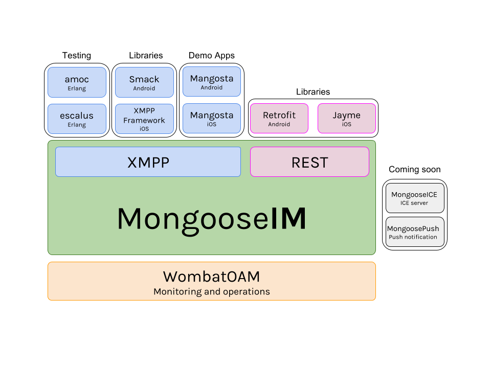

# MongooseIM platform

MongooseIM is robust and efficient XMPP platform aimed at large installations. Specifically designed for enterprise purposes, it is fault-tolerant, can utilize resources of multiple clustered machines and easily scale in need of more capacity (by just adding a box/VM). MongooseIM can accept client sessions over vanilla XMPP, Websockets, HTTP long-polling (a.k.a. BOSH), and a REST API.

The MongooseIM platform comes with server-side components and client libraries. We provide a test suite and a monitoring server. We recommand third-party, open source client libraries for XMPP and REST API.

The most important links:

* Home: [http://github.com/esl/MongooseIM](http://github.com/esl/MongooseIM)
* Product page: [https://www.erlang-solutions.com/products/mongooseim.html](https://www.erlang-solutions.com/products/mongooseim.html)
* Documentation: [http://mongooseim.readthedocs.org/](http://mongooseim.readthedocs.org/)

It is brought to you by [Erlang Solutions](https://www.erlang-solutions.com/) and [Inaka](http://inaka.net/).

    

## Download packages

For a quick start just download:

* The [pre-built packages](https://www.erlang-solutions.com/resources/download.html)
that suit your platform (Ubuntu, Debian, CentOS, and macOS)
* The [Docker image](https://hub.docker.com/r/mongooseim/mongooseim/): [https://hub.docker.com/r/mongooseim/mongooseim/](https://hub.docker.com/r/mongooseim/mongooseim/) (source code repository: [https://github.com/esl/mongooseim-docker](https://github.com/esl/mongooseim-docker))

## Public testing

Check out our test results:

* Continuous integration: [https://travis-ci.org/esl/MongooseIM](https://travis-ci.org/esl/MongooseIM)
* Code coverage: [https://coveralls.io/github/esl/MongooseIM](https://coveralls.io/github/esl/MongooseIM)
* Stay tuned... more soon!

## MongooseIM platform components

### Server-side components

We offer a set of server-side components:

* [WombatOAM](https://www.erlang-solutions.com/products/wombat-oam.html) is a powerful monitoring platform that comes with specific MongooseIM plugins
* Test suite - here are useful tools to test and validate your XMPP servers:
    * [escalus](https://github.com/esl/escalus): Erlang XMPP client
    * [amoc](https://github.com/esl/amoc): a load testing tools
    * [exml](https://github.com/esl/exml): XML parsing library in Erlang
* More components? There are some ideas we're working on. Tune in for updates on:
    * MongooseICE: ICE, STUN/TRUN server
    * MongoosePush: a push notification server

### Client-side components

* XMPP client libraries: we recommend following client libraries:
    * iOS, Objective-C: [XMPPframework](https://github.com/robbiehanson/XMPPFramework)
    * Android, Java: [Smack](https://github.com/igniterealtime/Smack)
    * Web, JavaScript: [Stanza.io](https://github.com/otalk/stanza.io), [Strophe.js](https://github.com/strophe/strophejs)
* REST API client libraries: we recommend following client libraries:
    * iOS, Swift: [Jayme](https://github.com/inaka/Jayme)
    * Android, Java: [Retrofit](https://github.com/square/retrofit)
* Mangosta clients, for messaging, and social:
    * iOS
    * Android

## Participate!

Suggestions, questions, thoughts? Contact us directly:

* Defacto standard [GitHub issues](https://github.com/esl/MongooseIM/issues): https://github.com/esl/MongooseIM/issues
* Email us at <a href='mailto:mongoose-im@erlang-solutions.com'>mongoose-im@erlang-solutions.com</a>
* Create a post on erlangcentral forums at <a href='https://erlangcentral.org/forum/mongooseim/'>https://erlangcentral.org/forum/mongooseim/</a>
* Follow our [Twitter account](https://twitter.com/MongooseIM): [https://twitter.com/MongooseIM](https://twitter.com/MongooseIM)
* Like our [Facebook page](https://www.facebook.com/MongooseIM/): [https://www.facebook.com/MongooseIM/](https://www.facebook.com/MongooseIM/)
* Subscribe to our [mailing list](https://groups.google.com/d/forum/mongooseim-announce) at [https://groups.google.com/d/forum/mongooseim-announce](https://groups.google.com/d/forum/mongooseim-announce) as it is only one or two emails per month, the archives are free and open (click on the blue button "Join group", then click in "Email delivery preference" on "Notify me for every new message")

## Documentation

Up-to-date documentation for the MongooseIM master branch can be found on ReadTheDocs:

* [http://mongooseim.readthedocs.org/en/latest/](http://mongooseim.readthedocs.org/en/latest/)
* [release 2.0.1](http://mongooseim.readthedocs.org/en/2.0.1/)
* Older versions:
    * [release 2.0.0](http://mongooseim.readthedocs.org/en/2.0.0/)
    * [release 1.6.2](http://mongooseim.readthedocs.org/en/1.6.2/)
    * [release 1.6.1](http://mongooseim.readthedocs.org/en/1.6.1/)
    * [release 1.6.0](http://mongooseim.readthedocs.org/en/1.6.0/)

When developing new features/modules, please make sure you add basic documentation
to the `doc/` directory, and add a link to your document in `doc/README.md`.

The MongooseIM platform documentation:

* User Guide
    * [Features and supported standards](user-guide/Features-and-supported-standards.md) contains the list of supported XEPs, RFCs and database backends
    * [Get to know MongooseIM](user-guide/Get-to-know-MongooseIM.md) contains the overview of our application, its architecture and deployment strategies
    * [Getting started](user-guide/Getting-started.md) is a step-by-step guide on how to:
        * Build MongooseIM on a supported OS
        * Perform basic configuration
        * Use the main administration script, `mongooseimctl`
    * [Release/Installation configuration](user-guide/release_config.md)
    * [High-level Architecture](user-guide/MongooseIM-High-level-Architecture.md) from single to multiple node setup to multi-datacenter
    * [How to build](user-guide/How-to-build.md) from source code
* Platform:
    * [Roadmap](Roadmap.md)
    * [Contributions](Contributions.md)
    * [Differentiators](Differentiators.md)
* Configuration
    * [Basic configuration](Basic-configuration.md)
    * [Advanced configuration](Advanced-configuration.md)
        * [Overview](Advanced-configuration.md)
        * [Database backends configuration](advanced-configuration/database-backends-configuration.md)
        * [Listener modules](advanced-configuration/Listener-modules.md)
        * [Extension modules](advanced-configuration/Modules.md)
        * [ACL](advanced-configuration/acl.md)
        * [HTTP authentication module](advanced-configuration/HTTP-authentication-module.md)
* MongooseIM open XMPP extensions:
    * [MUC light](open-extensions/muc_light.md)
    * [Token-based reconnection](open-extensions/token-reconnection.md)
* [REST API for client developers](REST-API.md)
* Operation and maintenance
    * [Cluster management considerations](operation-and-maintenance/Cluster-management-considerations.md)
    * [Cluster configuration and node management](operation-and-maintenance/Cluster-configuration-and-node-management.md)
    * [Logging & monitoring](operation-and-maintenance/Logging-&-monitoring.md)
    * [Reloading configuration on a running system](operation-and-maintenance/Reloading-configuration-on-a-running-system.md)
    * [Metrics](operation-and-maintenance/Mongoose-metrics.md)
    * [HTTP Administration API](http-api/http-administration-api-documentation.md)
    * [Distribution over TLS](operation-and-maintenance/tls-distribution.md)
* Server developer guide
    * [Testing MongooseIM](developers-guide/Testing-MongooseIM.md)
    * [REST Interface to Metrics](developers-guide/REST-interface-to-metrics.md)
    * [Hooks and handlers](developers-guide/Hooks-and-handlers.md)
    * [Hooks description](developers-guide/hooks_description.md)
    * [Stanza routing](developers-guide/message_routing.md)
    * [mod_amp developer's guide](developers-guide/mod_amp_developers_guide.md)
    * [mod_muc_light developer's guide](developers-guide/mod_muc_light_developers_guide.md)
    * [xep-tool usage](developers-guide/xep_tool.md)
    * [FIPS mode](developers-guide/OpenSSL-and-FIPS.md)
