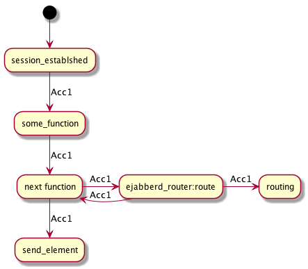

# Accumulators

XMPP stanza processing starts in the `ejabberd_c2s` module, which receives the stanza from a socket.
The stanza is processed and eventually it and/or other messages are sent out, either to the original sender, to another c2s process within the same MongooseIM installation, or to another XMPP server.

At the beginning of the main processing chain, an accumulator is created containing the stanza and other values.
It is then passed through all the stages, until it reaches the end of its life.
Throughout the process it is the very same accumulator; it is therefore possible to store a value in it on one stage of the processing and retrieve the same value later on.

The main assumption is that whatever the MongooseIM does, it is always triggered by a stanza entering the system, one way or another (with an exeption for REST methods and mongooseimctl, that should have their own methods of creating and processing an accumulator).
The stanza should always be packed into an accumulator and passed on, so that internally every action is performed the same way.

There are three main benefits from this approach:

a) performance - if we need to do something involving inspecting a stanza or more complicated operations (e.g. privacy check) we don't need to do it multiple times on various stages of processing - instead we can do it once and store the result in an accumulator

b) debugging - it is now very easy to produce an exact track record of a stanza

c) simplified implementation of modules which inherently involve multi-stage processing (e.g. mod_amp)

## Implementation

The accumulator is implemented in the `mongoose_acc` module, which exposes a number of methods for creating and modifying stanzas and retrieving values from them.
Under the hood an accumulator is just a map, but it may change in the future.

Initially an accumulator should be created from an `#xmlel{}` using `mongoose_acc:from_element/1` or `mongoose_acc:from_element/3`.
It should also contain `from`, `from_jid`, `to` and `to_jid` (those are set automatically if `mongoose_acc::from_element/3` is used), `user` and `server`.
Instantiation functions also set `timestamp` and `ref`.
The `to` part is optional, since not every stanza is directed to a specified jid.

Some attributes are calculated upon request and stored: these are `command`, `xmlns` and `iq_query_info`.
If they are needed, you should first use `mongoose_acc:require/2` and then just get:

```
Acc1 = mongoose_acc:require(command, Acc),
Cmd = mongoose_acc:get(command, Acc1)
```

You can set whatever attributes you want, but treat them as read-only - an accumulator is meant
to accumulate results and carry them forward with it, not to introduced a semi-mutable data structure.
If you put a value to a key which already exists it will work, but will also produce a
warning.

If you need to store multiple values under the same key, then either:
* use mongoose_acc:append/3
* or generate a unique key for each use

There is one exception: if you really must treat an acc to carry just one value back from a call,
use a key `result`, this is not monitored.

For mass updates (multiple key at once) consider using `mongoose_acc:update/2`, it may be
slightly more efficient. Be aware, however, that it will not warn you if you
overwrite an existing key.

## Entry points

The stanza enters MongooseIM in the following places:

### `ejabberd_c2s:session_established/2`

This is the handler for a stanza received from an XMPP client, after the session has been fully established (before that there is only technical communication between the user and the server, the main processing chain is not started).
Here we initialise the accumulator and pass it on.

### `ejabberd_c2s:handle_incoming_message/3`

This is called by `ejabberd_c2s:handle_info/3` when an accumulator from another c2s process is received.
It is a ready-made accumulator, but stripped of all cached values; it preserves the original `ref`, `timestamp`, `from` and `to`, but doesn't have the `user` and `server` which have to be set here since they are likely to differ.

### `ejabberd_s2s_in:stream_established/2` (not done yet)

Here is where a stanza from another MongooseIM server is received.

## Hooks

Many of the MongooseIM functionalities are implemented in submodules which attach their handlers to hooks (this is covered in detail in ["Hooks and handlers"](Hooks-and-handlers.md).
When it comes to the accumulators, the following rules apply:

* when using `run_fold` there are only a few cases in which something else should be passed as the accumulator.
 This is the case when for example the handlers are supposed to modify the state (the state should be the accumulator).
 Your handlers should stash their results in the acc, so that you can extract what you need and pass the modified acc on.
* avoid passing superfluous arguments to handlers - e.g. a `Server` in hook args is redundant since it is already present in the accumulator.
* do not use `run` - it is against the main design principles.
 All handlers have been rewritten so that they accept an acc as the first arg. 
 If you use `run_fold` you have to provide an accumulator, if you use `run` an empty accumulator is created and passed to the handlers.
 Note that `run` is deprecated now and at some point will be removed.

Most handlers have already been modified so that they accept an instance of `mongoose_acc:t()` as the first argument and return value by storing it inside it.
How the accumulator is used within a module is up to the implementors of the module.

## Exit points

The notion of an exit point is a bit vague, because sending a stanza out of MongooseIM doesn't necessarily mean that processing of the accumulator is terminated.
A single stanza entering the system creates an acc, but then may result in multiple stanzas going out - for example changing a privacy list triggers presence updates and a roster push.
It is in fact hard to determine when the process has really been finished.
The approach is to pass along one acc and, when something is just about to be sent out, either send a text and return the acc or pass on a clone of the acc and return the original one.
This gives us an option to record a fact that a stanza has been sent out.
When the last stanza in the whole process is leaving the system we have a complete record of what we have sent in the meantime.

An 'exit point' is where we call a function sending something out of the system and, if all goes well, returning the original accumulator possibly with an additional track record of what's just been done.

See the diagram to examine this concept.
Note that Acc1 going to the routing has the same `ref` as the one returning to the next function:




An 'exit point' function should be called with an acc AND a stanza to be sent out. 
Sometimes the stanza is the original one (which is stored in the accumulator as `element`), sometimes it's not.
The 'exit point' should return an accumulator.

Sending data out can be done in two ways:

* if we send it out of MongooseIM through a socket, we send a binary representation of the stanza to be sent,
* if we send it to another c2s process within the same MongooseIM, we create another accumulator with the `element` replaced by the stanza we are sending, but preserving some useful attributes.
This is done by `mongoose_acc:strip/1`.

### `ejabberd_c2s:send_element/3`

Here we send a stanza to an XMPP client.
It is often called directly by a c2s process when it needs to respond to its "owner".

### `ejabberd_router:route/4`

This function is called when a stanza is ready to be sent.
It makes an attempt to route it out via the appropriate channel - either locally to the same or another c2s process, or somewhere else via s2s.
The stanza can be sent or dropped, or it may error out - whatever it does this function returns the original accumulator, optionally with the track record of what it tried to send, how and to what effect (see the commented out code in `mongoose_acc:record_sending/4`).

Under the hood the routing modules work by passing a raw stanza, cloning the accumulator and storing the outgoing stanza with a `to_send` attr.
The acc is then passed on and either sent to another c2s process by `ejabberd_sm`, stored as offline, or sent out to another XMPP server via `ejabberd_s2s`.

## Sample usage, actual and potential

### Privacy check

Stanzas are often checked against privacy lists.
According to the current `mongoose_privacy:privacy_check_packet` implementation, the result is stored in an accumulator so if a check has to be repeated it is just one map read.

### Tracing hooks and handlers

`ejabberd_hooks:record` functions contain some (commented out for now) code which adds a record to the accumulator every time it is passed to a hook and every time it goes through a hook handler.
This is very valuable for debugging.

### Performance measurement

Given that each accumulator has a timestamp denoting its creation time, it is now very easy to implement a metric showing the stanza processing time, or even multiple metrics splitting it into stages.

### `mod_amp`


