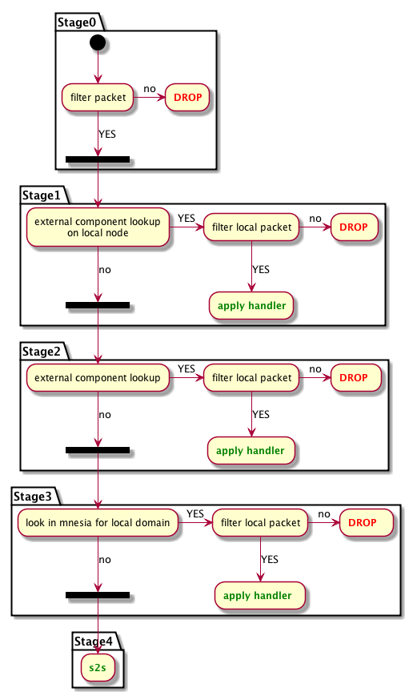

# Route of a message through the system

Let's examine the flow of a message sent from user A to user B, both of whom are served by the same domain.

Note that hooks are called at various stages of routing - they perform many tasks, in fact, many MongooseIM functionalities are implemented through hooks & handlers. 
For a general introduction to hooks, see [Hooks and Handlers](Hooks-and-handlers.md); to get a closer look at a core few, see [hooks description](hooks_description.md).

**1. Receiving the stanza**

User A's `ejabberd_receiver` receives the stanza and passes it to `ejabberd_c2s`.

**2. Call to `user_send_packet`**

Upon some minimal validation of the stanza, a hook `user_send_packet` is called.
This is handled by a couple of modules which subscribe to this hook. 
Those modules do various complementary tasks, like storing the message in an archive, sending carbon copies, etc.

**3. Privacy lists and `ejabberd_router:route/3`**

The stanza is checked against any privacy lists in use and, in the case of being allowed, it will be routed by `ejabberd_router:route/3`. 
This also takes into account "blocking commands", which are part of the privacy system.

**4. Chain of routing**

Further on, the behaviour is configurable: `ejabberd_router:route/3` passes the stanza through a chain of routing modules and applies `Mod:filter/3` and `Mod:route/3` from each of them.
Each of those modules has to implement `xmpp_router` behaviour.

There are a few actions available to the module:

* it can drop or route the stanza,
* it can pass the stanza on unchanged or modify it and pass the result on.

A set of routing modules can be set in configuration as `routing_modules`. 
The default behaviour is the following:

* `mongoose_router_global`: runs a global `filter_packet` hook
* `mongoose_router_external_local`: checks if there is an external component registered for the destination domain on the current node, possibly routes the stanza to it
* `mongoose_router_external`: checks if there is an external component registered for the destination domain on any node in the cluster, possibly routes the stanza to it
* `mongoose_router_localdomain`: checks if there is a local route registered for the destination domain (i.e. there is an entry in mnesia `route` table), possibly routes the stanza to it
* `ejabberd_s2s`: tries to find or establish a connection to another server and send the stanza there



**5. Look up `external_component` and `route`**

An external component and a local route are obtained by looking up `external_component` and `route` mnesia tables, respectively. 
The items stored in the tables provide funs to call and MFs to apply:

    ```erlang
    (ejabberd@localhost)2> ets:tab2list(route).
    [{route,<<"vjud.localhost">>,
            {apply_fun,#Fun<ejabberd_router.2.123745223>}},
     {route,<<"muc.localhost">>,
            {apply_fun,#Fun<mod_muc.2.63726579>}},
     {route,<<"localhost">>,{apply,ejabberd_local,route}}]
    ```

Here we see that for a domain "localhost" `ejabberd_local:route()`is called.
Routing the stanza there means calling `mongoose_local_delivery:do_route/5`, which calls `filter_local_packet` hook and, if passed, runs the fun or applies the handler.
In most cases, the handler is `ejabberd_local:route/3`.

**6. `ejabberd_local` to `ejabberd_sm`**

`ejabberd_local` routes the stanza to `ejabberd_sm` given it has at least a bare JID as the recipient.

**7. `ejabberd_sm`**

`ejabberd_sm` determines the available resources of User B, takes into account their priorities and whether the message is addressed to a particular resource or a bare JID. 
It appropriately replicates (or not) the message and sends it to the recipient's `ejabberd_c2s` process(es).

In case no resources are available for delivery (hence no `ejabberd_c2s` processes to pass the message to), `offline_message_hook` is run.

**8. `ejabberd_c2s`**

`ejabberd_c2s` verifies the stanza against relevant privacy lists and sends it to the socket.
`user_receive_packet` hook is run to notify the rest of the system about the stanza delivery to User B.
