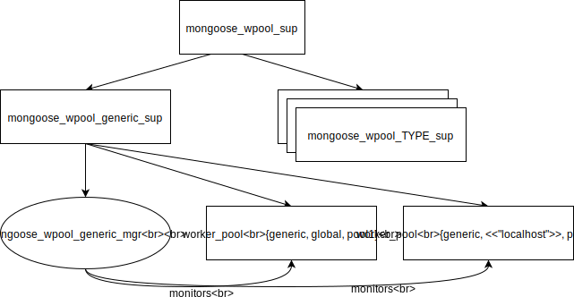

# mongoose_wpool

All the [outgoing pools] configured by the `outgoing_pools` option are hidden behind the `mongoose_wpool` API.
Every pool is described by a tuple `{Type, Host, Tag, PoolOptions, ConnectionOptions}` (see [outgoing pools] for details about each element of the tuple).

## Supervision tree

* `mongoose_wpool_sup` supervisor for every type of the pool. Under it there can be many children of:
    * `mongoose_wpool_type_sup` is started on-demand when a pool of given type is started.
      Many pools of the same type are supervised by the supervisor. Its children are:
        * `mongoose_wpool_mgr` all the pools of the same type are managed by a manager.
           It's responsible for starting, stopping and restarting the pool.
           Restarting happens when the main `worker_pool` process for the pool is stopped unintentionally.
           This usually happens when there was too many restarts of worker processes.
        * many `worker_pool` supervisors holding a specific pool are on the same level as the manager.

The `mongoose_wpool_mgr` manages the pool by setting monitor for every started pool.

## Implementing new pool type

To add a new pool type, create a `mongoose_wpool_NEW_TYPE` module implementing the `mongoose_wpool` behaviour.
This means that for a new type `xyz` we need to create a `mongoose_wpool_xyz` module.
Then we can use the `xyz` type to start the pool via `outgoing_pools` option or directly via the `mongoose_wpool` API.

[outgoing pools]: ../advanced-configuration/outgoing-connections.md
