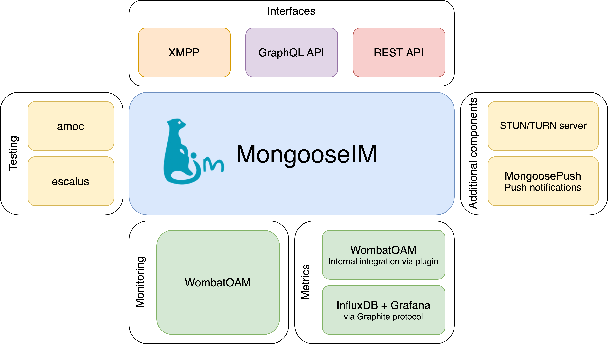

# MongooseIM platform
   

* Home: [http://github.com/esl/MongooseIM](http://github.com/esl/MongooseIM)
* Product page: [https://www.erlang-solutions.com/products/mongooseim.html](https://www.erlang-solutions.com/products/mongooseim.html)
* Documentation: [https://mongooseim.readthedocs.org/](https://mongooseim.readthedocs.org/)

## Get to know MongooseIM

MongooseIM is a robust and efficient chat (or instant messaging) platform aimed at large installations.

Designed for enterprise, it is fault-tolerant, can utilise the resources of multiple clustered machines, and easily scales for more capacity by simply adding a box or VM.

MongooseIM can accept client sessions over vanilla XMPP, REST API and SSE, as well as Websockets, and BOSH (HTTP long-polling).

As a platform, MongooseIM includes several server-side (backend) and client-side (frontend) components.
We provide a test suite, metrics, a load testing platform, and a monitoring server.
We recommend third-party, open source client libraries for XMPP and REST API.

MongooseIM is brought to you by [Erlang Solutions](https://www.erlang-solutions.com/).

## MongooseIM platform components

### Server-side components

We offer a set of server-side components:

* [WombatOAM](https://www.erlang-solutions.com/products/wombat-oam.html) is a powerful monitoring platform that comes with a dedicated MongooseIM plugin
* Test suite - here are some useful tools to test and validate your XMPP servers:
    * [escalus](https://github.com/esl/escalus): Erlang XMPP client
    * [amoc](https://github.com/esl/amoc): a load testing tools
* [MongooseICE](https://github.com/esl/MongooseICE): is a STUN and TURN server written for traversing NATs and relaying streams
* [MongoosePush](https://github.com/esl/MongoosePush): is a flexible push notification server with APNS and FCM support

### Client-side components

* XMPP client libraries - we recommend the following client libraries:
    * iOS, Objective-C: [XMPPframework](https://github.com/robbiehanson/XMPPFramework)
    * Android, Java: [Smack](https://github.com/igniterealtime/Smack)
    * Web, JavaScript: [Stanza.io](https://github.com/otalk/stanza.io), [Strophe.js](https://github.com/strophe/strophejs)
* REST API client libraries - we recommend following client libraries:
    * iOS, Swift: [Jayme](https://github.com/inaka/Jayme)
    * Android, Java: [Retrofit](https://github.com/square/retrofit)

## Download packages

For a quick start just download:

* The [pre-built packages](https://www.erlang-solutions.com/resources/download.html) that suit your platform (Ubuntu, Debian, CentOS, and macOS)
* The [Docker image](https://hub.docker.com/r/mongooseim/mongooseim/): [https://hub.docker.com/r/mongooseim/mongooseim/](https://hub.docker.com/r/mongooseim/mongooseim/) (source code repository: [https://github.com/esl/mongooseim-docker](https://github.com/esl/mongooseim-docker))

## Public testing

Check out our test results:

* Continuous integration: [https://travis-ci.org/esl/MongooseIM](https://travis-ci.org/esl/MongooseIM)
* Code coverage: [https://codecov.io/gh/esl/MongooseIM](https://codecov.io/gh/esl/MongooseIM)
* Continuous Load Testing: [http://tide.erlang-solutions.com/](http://tide.erlang-solutions.com/)
* Load test history:
  

## Versions

See the documentation for the latest releases:

* [Master](https://mongooseim.readthedocs.org/en/latest/)
* [3.6.0](https://mongooseim.readthedocs.io/en/3.6.0/)
* [3.5.0](https://mongooseim.readthedocs.io/en/3.5.0/)
* [3.4.0](https://mongooseim.readthedocs.io/en/3.4.0/)
* [3.3.0](https://mongooseim.readthedocs.io/en/3.3.0/)
* [3.2.0](https://mongooseim.readthedocs.io/en/3.2.0/)
* [3.1.0](https://mongooseim.readthedocs.io/en/3.1.0/)
* [3.0.0](https://mongooseim.readthedocs.io/en/3.0.0/)
* [2.2.2](https://mongooseim.readthedocs.io/en/2.2.2/)
* [2.1.1](https://mongooseim.readthedocs.io/en/2.1.1/)
* [2.1.0](https://mongooseim.readthedocs.io/en/2.1.0/)
* [2.0.1](https://mongooseim.readthedocs.io/en/2.0.1/)
* [2.0.0](https://mongooseim.readthedocs.io/en/2.0.0/)
* [1.6.2](https://mongooseim.readthedocs.io/en/1.6.2/)
* [1.6.1](https://mongooseim.readthedocs.io/en/1.6.1/)
* [1.6.0](https://mongooseim.readthedocs.io/en/1.6.0/)

When developing new features/modules, please make sure you add basic documentation to the `doc/` directory, and add a link to your document in `doc/README.md.`

## Participate!

Suggestions, questions, thoughts? Contact us directly:

* Raise a [GitHub issue](https://github.com/esl/MongooseIM/issues): https://github.com/esl/MongooseIM/issues
* Email us at <a href='mailto:mongoose-im@erlang-solutions.com'>mongoose-im@erlang-solutions.com</a>
* Follow our [Twitter account](https://twitter.com/MongooseIM): [https://twitter.com/MongooseIM](https://twitter.com/MongooseIM)
* Like our [Facebook page](https://www.facebook.com/MongooseIM/): [https://www.facebook.com/MongooseIM/](https://www.facebook.com/MongooseIM/)
* Subscribe to our [mailing list](https://groups.google.com/d/forum/mongooseim-announce) at [https://groups.google.com/d/forum/mongooseim-announce](https://groups.google.com/d/forum/mongooseim-announce) to receive no more than two montly emails as well as access to the free and open archives.
