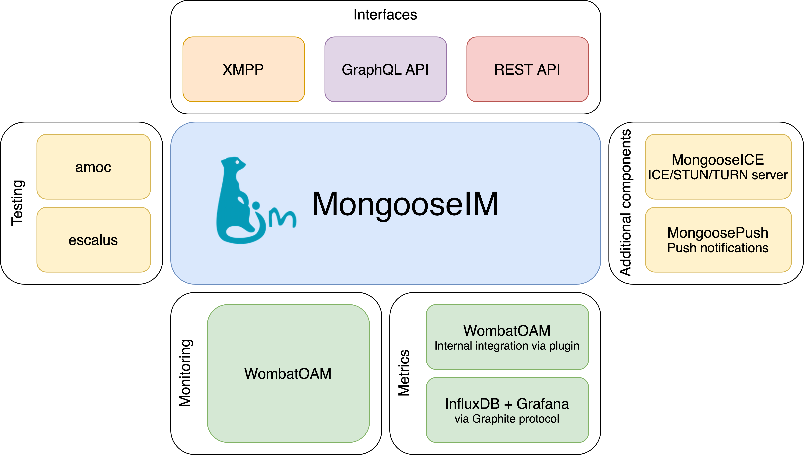

# MongooseIM platform overview

* Home: [https://github.com/esl/MongooseIM](https://github.com/esl/MongooseIM)
* Product page: [https://www.erlang-solutions.com/products/mongooseim.html](https://www.erlang-solutions.com/products/mongooseim.html)
* Documentation: [https://esl.github.io/MongooseDocs/](https://esl.github.io/MongooseDocs/)

## Get to know MongooseIM

MongooseIM is a robust, scalable and efficient XMPP server at the core of an Instant Messaging platform aimed at large installations.

Designed for enterprise, it is fault-tolerant, can utilise the resources of multiple clustered machines, and easily scales for more capacity by simply adding a box or a VM.

MongooseIM can accept client sessions over vanilla XMPP, REST API and SSE, as well as Websockets and BOSH (HTTP long-polling).

As a platform, MongooseIM includes several server-side (backend) and client-side (frontend) components.
We provide a test suite, metrics, a load testing platform, and a monitoring server.
We recommend third-party, open source client libraries for XMPP and REST API.

MongooseIM is brought to you by [Erlang Solutions](https://www.erlang-solutions.com/).

## MongooseIM platform components

### Server-side components

We offer a set of additional server-side components:

* [WombatOAM](https://www.erlang-solutions.com/products/wombat-oam.html) is a powerful monitoring platform that comes with a dedicated MongooseIM plugin
* Test suite is written with the help of these useful tools:
    * [escalus](https://github.com/esl/escalus): an XMPP client for Erlang
    * [amoc](https://github.com/esl/amoc): a load testing tool
* [MongooseICE](https://github.com/esl/MongooseICE): is a STUN and TURN server written for traversing NATs and relaying streams
* [MongoosePush](https://github.com/esl/MongoosePush): is a flexible push notification server with APNS and FCM support

### Client-side components

* XMPP client libraries - we recommend the following client libraries:
    * iOS, Objective-C: [XMPPFramework](https://github.com/robbiehanson/XMPPFramework)
    * Android, Java: [Smack](https://github.com/igniterealtime/Smack)
    * Web, JavaScript: [Stanza.io](https://github.com/otalk/stanza.io), [Strophe.js](https://github.com/strophe/strophejs)
* REST API client libraries - we recommend the following client libraries:
    * iOS, Swift: [Jayme](https://github.com/inaka/Jayme)
    * Android, Java: [Retrofit](https://github.com/square/retrofit)

## Download packages

For a quick start just download:

* The [pre-built packages](https://www.erlang-solutions.com/resources/download.html) that suit your platform (Ubuntu, Debian and CentOS)
* The [Docker image](https://hub.docker.com/r/mongooseim/mongooseim/) ([source code repository](https://github.com/esl/mongooseim-docker))
* The [Helm chart](https://artifacthub.io/packages/helm/mongoose/mongooseim) ([source code repository](https://github.com/esl/MongooseHelm))

See the [installation guide](getting-started/Installation.md) for more details.

## Public testing

Check out our test results:

* CI testing:
    * [GH Actions](https://github.com/esl/MongooseIM/actions?query=workflow%3ACI)
    * [CircleCI](https://app.circleci.com/pipelines/github/esl/MongooseIM)
* Code coverage:
    * [Codecov](https://codecov.io/gh/esl/MongooseIM) - reported by CircleCI.
    * [Coveralls](https://coveralls.io/github/esl/MongooseIM) - reported by GH Actions.

## Versions

See the documentation for the latest releases:

* [Master](https://esl.github.io/MongooseDocs/latest/)
* [5.1.0](https://esl.github.io/MongooseDocs/5.1.0/)
* [5.0.0](https://esl.github.io/MongooseDocs/5.0.0/)
* [4.2.0](https://esl.github.io/MongooseDocs/4.2.0/)
* [4.1.0](https://esl.github.io/MongooseDocs/4.1.0/)
* [4.0.1](https://esl.github.io/MongooseDocs/4.0.1/)
* [3.7.1](https://esl.github.io/MongooseDocs/3.7.1/)
* [3.6.2](https://esl.github.io/MongooseDocs/3.6.2/)
* [3.5.0](https://esl.github.io/MongooseDocs/3.5.0/)
* [3.4.1](https://esl.github.io/MongooseDocs/3.4.1/)
* [3.3.0](https://esl.github.io/MongooseDocs/3.3.0/)
* [3.2.0](https://esl.github.io/MongooseDocs/3.2.0/)
* [3.1.1](https://esl.github.io/MongooseDocs/3.1.1/)
* [3.0.1](https://esl.github.io/MongooseDocs/3.0.1/)

## Participate!

Suggestions, questions, thoughts? Contact us directly:

* Raise a [GitHub issue](https://github.com/esl/MongooseIM/issues)
* Email us at <a href='mailto:mongoose-im@erlang-solutions.com'>mongoose-im@erlang-solutions.com</a>
* Follow our [Twitter account](https://twitter.com/MongooseIM)
