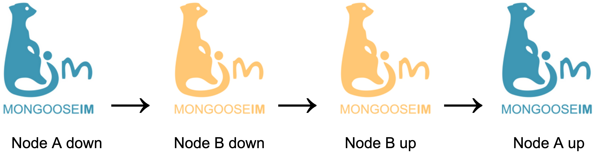
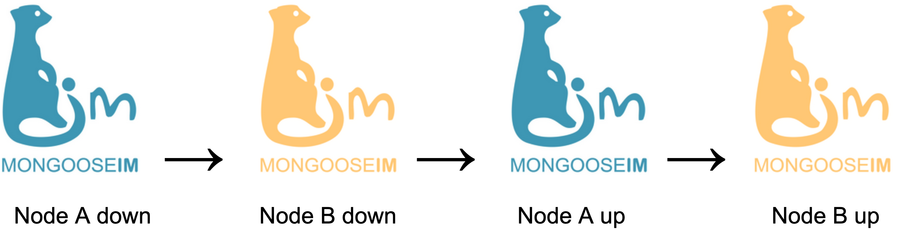

When you are using a MongooseIM cluster that is using Mnesia backend for any extensions, there could occur an issue related to the distributed Mnesia nodes.

## How to restart a cluster:

Having Node A and Node B, the cluster restart procedure should occur in the following way:

Start the nodes in the opposite order to the one in which they were stopped.
The first node you restart should be the last one to go down.
For cluster with 3 nodes, after stopping the nodes `ABC`, they should be started in `CBA` order.

## How NOT to restart a cluster:

Having Node A and Node B.

When the nodes are stopped in `AB` order, starting the node `A` first can result in issues related to the distributed Mnesia nodes and not bring up a node that is fully operational.

Changing the order of the restarted nodes can cause issues with distributed Mnesia.
Make sure to follow the recommendations if you are using Mnesia backend for any of the extensions.
Please note that for some of the extensions, the Mnesia backend is set by default without having that configured explicitly in the configuration file.

For more information related to the cluster configuration and maintenance, please see [Cluster configuration and node management](Cluster-configuration-and-node-management.md) section.
