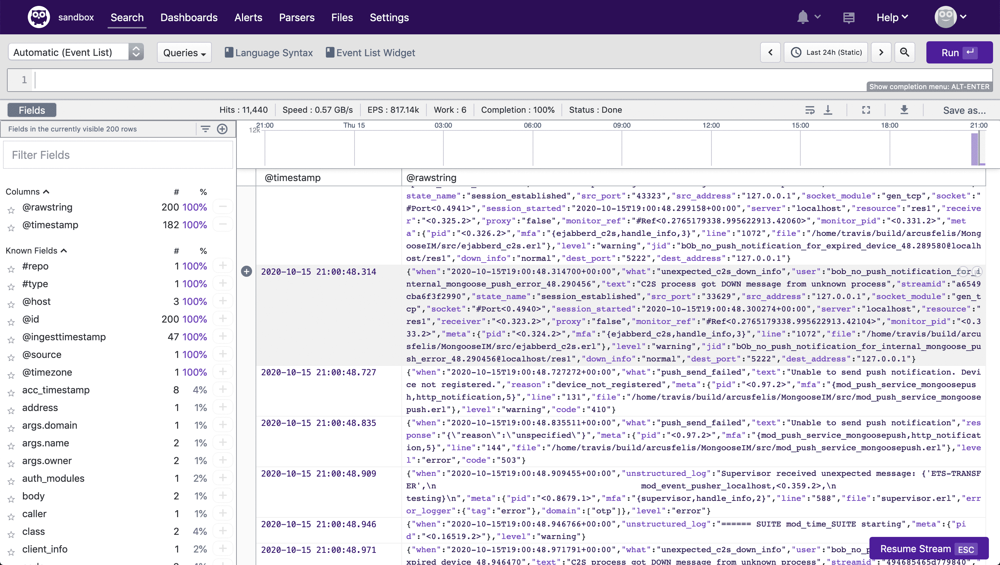
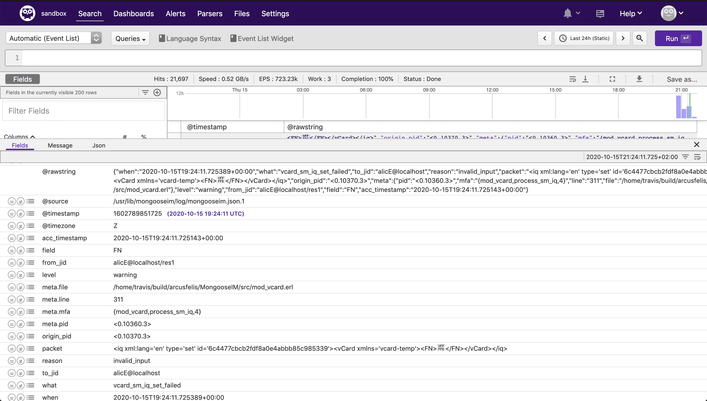

# Humio and MongooseIM

## Getting Humio's ingest token

Visit this [url](https://cloud.humio.com/sandbox/settings/ingest-tokens) to create a new sandbox's ingest token.

The URL is:

```
https://cloud.humio.com/YOUR_REPOSITORY_NAME_HERE/settings/ingest-tokens
```

## Configure Filebeat

Configure Filebeat, using this config file [priv/filebeat.mongooseim.humio.yml](https://github.com/esl/MongooseIM/blob/master/priv/filebeat.humio.yml).

We recommend to use the Filebeat docker container. You have to use an open-source version
of Filebeat, which has the `oss` suffix.

This example mounts a log directory `$(pwd)/_build/mim1/rel/mongooseim/log` as a volume for Filebeat.
It also mounts a configuration file `$(pwd)/priv/filebeat.mongooseim.humio.yml`.
Most likely these paths would be different on your machine.

Pass your Humio ingest token as a password argument.
Or uncomment and change it inside the `filebeat.mongooseim.humio.yml` file.

```bash
docker run -d \
    --name mongooseim-filebeat \
    -v "$(pwd)/_build/mim1/rel/mongooseim/log:/usr/lib/mongooseim/log" \
    -v "$(pwd)/priv/filebeat.mongooseim.humio.yml:/usr/share/filebeat/filebeat.yml:ro" \
    docker.elastic.co/beats/filebeat-oss:7.9.2 \
    filebeat -e -E output.elasticsearch.password="abc12345-xxxx-yyyy-zzzz-123456789abc"
```

Argument `-e` enables debugging information for Filebeat that can be visible using the `docker logs mongooseim-filebeat` command.

## Viewing logs

Navigate to [https://cloud.humio.com/sandbox/search](https://cloud.humio.com/sandbox/search) to see the Sandbox's dashboard.


A list of log messages:




Structured log message:


