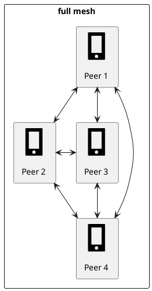
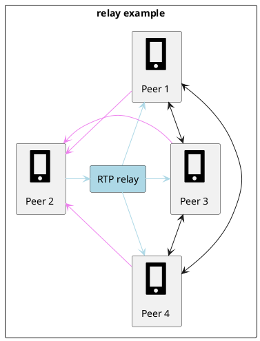
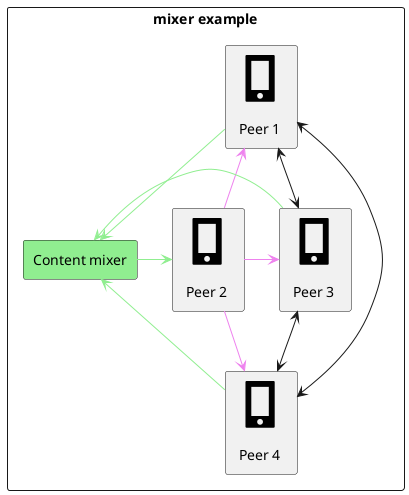
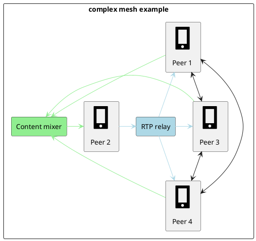
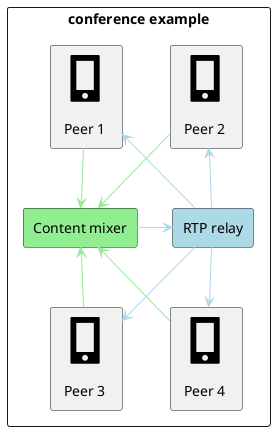
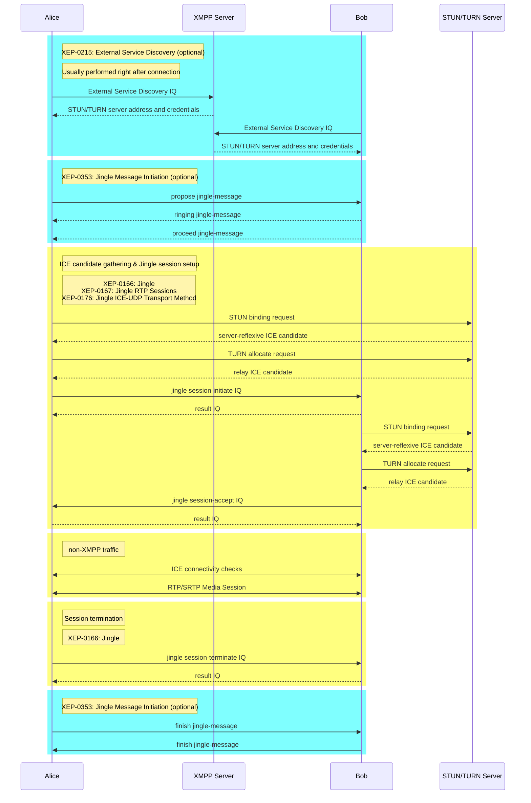

# XMPP Audio and Video Tutorial

## Overview
The XMPP standard does not natively support the transmission of audio or video data. Instead, XMPP is commonly used as a signaling layer to establish, manage, and terminate [RTP]-based audio and video sessions between clients. This functionality is defined by a collection of XMPP Extension Protocols (XEPs) collectively known as the [Jingle protocol].

## Jingle Protocol Support
No special support for Jingle is required on the XMPP server itself. However, deploying a robust Jingle-based audio/video solution often requires additional server-side components, including:
* [STUN]/[TURN] servers for [NAT traversal].
* `RTP relays`, which forward incoming [RTP] streams to all participants except the sender. These are useful for small group calls.
* `Content mixers`, which combine multiple [RTP] input streams into a single output stream. These are essential for large video conferences.
* XMPP `focus agents`, which coordinate conference calls. Each participant establishes a Jingle session only with the `focus agent` and receives conference updates from it.
* `Gateways` for interaction with other systems (e.g. [SIP]-based infrastructure)

Each of these components is discussed in more detail later in this tutorial.

## The Jingle Framework
The core Jingle specification is [XEP-0166], which defines multimedia sessions and the mechanisms for negotiating, managing, and terminating them. Session negotiation takes place over XMPP, while the actual media exchange usually occurs outside of XMPP.

During session initialization, peers must agree on:
* Application format - the type of media being exchanged (e.g., audio or video).
* Transport method - how the media data is transmitted.
* Optional security preconditions for the selected transport.

[XEP-0166] intentionally does not define specific application formats or transport methods; these are specified in separate XEPs.

### Jingle Application Formats
Currently, two major Jingle application formats are defined:
* [XEP-0167]: Defines Jingle [RTP] sessions for audio and video.
* [XEP-0234]: Defines Jingle file transfer sessions.

This tutorial focuses exclusively on Jingle [RTP] sessions.

### Jingle Transport Methods
Several XEPs describe transport mechanisms, but only two are suitable for real-time audio and video:
* [XEP-0177]: Jingle Raw UDP Transport
* [XEP-0176]: Jingle ICE-UDP Transport

Raw UDP does not support [NAT traversal] or connectivity checks. When [NAT traversal] is required (which is almost always the case), clients should use ICE-UDP, as defined in [XEP-0176].

## Audio and Video Call Scenarios
Different call scenarios require different types of server-side infrastructure. Below are the most common configurations.

### One-to-One Calls
This is the simplest scenario and is widely supported by interoperable XMPP clients. In fact, many clients support only one-to-one audio/video calls. Key characteristics include:
* Minimal server-side infrastructure requirements.
* Only a [STUN]/[TURN] server is needed to handle [NAT traversal].
* [STUN] and [TURN] are open standards, and their use is clearly defined by [ICE] and [XEP-0176].
* [XEP-0215] (External Service Discovery) allows clients to automatically discover and configure [STUN]/[TURN] servers.

### Small Group Calls (Mesh Topology)
For small groups (typically up to four participants for video), each participant can establish a separate Jingle session with every other participant. This approach is described in [XEP-0272] (MuJi - Multiparty Jingle). However, it has several drawbacks:
* High bandwidth usage: each client must send its media stream N times and receive N streams.
* Strict codec agreement: all participants must use compatible audio/video formats.
* Client-side mixing: each participant must mix incoming audio and video streams locally.

[STUN]/[TURN] servers can still be used to establish peer-to-peer connections, similar to one-to-one calls.

[XEP-0272] also suggests using `RTP relays` to reduce upstream bandwidth usage.

To further reduce downstream bandwidth and CPU usage, `content mixers` can be introduced.

However, to ensure interoperability, each client must independently allocate its own `RTP relay` and `content mixer`.

This results in inefficiencies, as the same optimization components are duplicated for each participant. In practice, this approach often evolves from a mesh topology into a star topology.

### Large Conference Calls (Star Topology)
Large conferences require a centralized architecture. In this model:
* A `content mixer` and `RTP relay` (often implemented as a single component) are allocated for the conference.
* A `focus agent` is responsible for allocating and managing these resources.
* Each participant establishes an individual Jingle session with the `focus agent`, similar to a one-to-one call.

Conference management is partially defined by:
* [XEP-0298] (COIN - Conference Information)
* [XEP-0340] (COLIBRI - Conferences with Lightweight Bridging)

Typically, one of the participants takes on the role of the `focus agent`; however, this role does not need to be held by a call participant. Instead, the `focus agent` may also be implemented as a server-side entity, such as:
- a custom XMPP server extension module, or
- an external XMPP component.

While it is technically possible to host the `mixer` and `relay` on a participant’s device, this usually leads to poor performance.

Introducing a `content mixer` provides several advantages:
* Relaxed codec compatibility requirements (e.g., different participants can use different formats).
* Support for multiple output formats, such as high and low-resolution video streams.
* The ability to implement server-side call recording.

However, this architecture also eliminates true end-to-end encryption.

## Other Useful XEPs for Audio/Video Support
Besides the mentioned Jingle specifications, the following XEPs are particularly relevant for audio and video implementations:
| XEP | Name | Description |
|-----|------|-------------|
| [XEP-0353] | Jingle Message Initiation | Defines a lightweight, message-based mechanism for initiating Jingle audio/video sessions, including appropriate selection among multiple available responder resources (connected responder devices). |
| [XEP-0320] | Use of DTLS-SRTP in Jingle Sessions | Describes how to secure Jingle RTP media streams using DTLS-SRTP. |
| [XEP-0482] | Call Invites | Partially overlaps with [XEP-0353], but provides a more generic call invitation mechanism not limited to Jingle. |

Several additional XEPs define the mapping between [SDP] and Jingle protocols:
* [XEP-0338] Jingle Grouping Framework
* [XEP-0339] Source-Specific Media Attributes in Jingle
* [XEP-0293] Jingle RTP Feedback Negotiation
* [XEP-0294] Jingle RTP Header Extensions Negotiation
* [XEP-0507] Jingle Content Category

Finally, the following XEPs provide guidelines for audio and video codec support:
* [XEP-0299] Codecs for Jingle Video
* [XEP-0266] Codecs for Jingle Audio

## Jingle Gateways
Because Jingle media is transported outside the XMPP connection and audio/video is carried over [RTP] sessions, it is possible to implement signaling-only gateways to [RTP]/[SDP]-compatible systems such as [SIP]-based communicators and IP telephony infrastructure.

A gateway is typically implemented as a custom XMPP server extension module or as an external XMPP component. From the XMPP client’s perspective, it appears as a regular Jingle endpoint, so no separate XEP is required to define its behavior.

In practice, however, such gateways often rely on additional protocol extensions and implementation-specific customizations.

Please note that SIP compatibility is among the initial objectives of the Jingle protocol. There are some attempts to standardize the mapping of Jingle actions to SIP methods (see [draft-ietf-stox-media]), MongooseIM also provides a custom Jingle-SIP gateway implementation: [mod_jingle_sip]

## Sample One-to-One Session
Below is a sequence diagram of a successful one-to-one Jingle session establishment and termination:

For simplicity, the diagram assumes that participants gather `host`, `server-reflexive` and `relay` [ICE] candidates before the `session-initiate` and `session-accept` exchange and include them directly in the Jingle IQs. In practice, however, the `Trickle ICE` connectivity-check procedure can be used to reduce connection establishment time. In this case, the `<transport/>` element in the `session-initiate` and `session-accept` IQs is left empty, and each [ICE] candidate is sent separately as the payload of a `transport-info` IQs.

Candidates may also be renegotiated via `transport-info` IQs after media flow has begun, enabling adaptation to changing network conditions (for example, switching from a mobile network to Wi-Fi).

## Frequently Asked Questions

### The listed XEPs do not provide all the required functionality. What are my options?
Standardizing group audio and video calling is challenging. Because there is no common protocol standard for `RTP relays` or `content mixers`, XEPs tend to push vendor-specific logic onto the client side. As a result, interoperable group calling is not widely supported by XMPP clients. If interoperability is not a strict requirement, existing XEPs can serve as useful design references.

### Is there an alternative to using [STUN]/[TURN] servers?
Yes. [XEP-0278] (Jingle Relay Nodes) provides an alternative, but it has not seen widespread adoption. In practice, [TURN] servers are more flexible and commonly used.

### Do I still need [STUN]/[TURN] if I use a public `content mixer` or `RTP relay`?
Yes. Even with public IP addresses, a [STUN]/[TURN] server is recommended as a fallback mechanism, particularly for clients behind strict firewalls.

### Why is an `RTP relay` needed if [TURN] already acts as a relay?
TURN servers are not designed for efficient multicasting. When sending media to multiple peers via [TURN], the client must still upload the same stream multiple times. `RTP relays` are better suited for distributing a single incoming stream to many recipients.

### For more information about [STUN]/[TURN] servers, see the [dedicated page][TURN tutorial].

[XEP-0166]: https://xmpp.org/extensions/xep-0166.html
[XEP-0167]: https://xmpp.org/extensions/xep-0167.html
[XEP-0234]: https://xmpp.org/extensions/xep-0234.html
[XEP-0177]: https://xmpp.org/extensions/xep-0177.html
[XEP-0176]: https://xmpp.org/extensions/xep-0176.html
[XEP-0215]: https://xmpp.org/extensions/xep-0215.html
[XEP-0272]: https://xmpp.org/extensions/xep-0272.html
[XEP-0298]: https://xmpp.org/extensions/xep-0298.html
[XEP-0340]: https://xmpp.org/extensions/xep-0340.html
[XEP-0278]: https://xmpp.org/extensions/xep-0278.html
[XEP-0353]: https://xmpp.org/extensions/xep-0353.html
[XEP-0320]: https://xmpp.org/extensions/xep-0320.html
[XEP-0482]: https://xmpp.org/extensions/xep-0482.html
[XEP-0338]: https://xmpp.org/extensions/xep-0338.html
[XEP-0339]: https://xmpp.org/extensions/xep-0339.html
[XEP-0293]: https://xmpp.org/extensions/xep-0293.html
[XEP-0294]: https://xmpp.org/extensions/xep-0294.html
[XEP-0507]: https://xmpp.org/extensions/xep-0507.html
[XEP-0299]: https://xmpp.org/extensions/xep-0299.html
[XEP-0266]: https://xmpp.org/extensions/xep-0266.html
[Jingle protocol]: https://en.wikipedia.org/wiki/Jingle_(protocol)
[RTP]: https://en.wikipedia.org/wiki/Real-time_Transport_Protocol
[SDP]: https://en.wikipedia.org/wiki/Session_Description_Protocol
[SIP]: https://en.wikipedia.org/wiki/Session_Initiation_Protocol
[NAT traversal]: https://en.wikipedia.org/wiki/NAT_traversal
[ICE]: https://en.wikipedia.org/wiki/Interactive_Connectivity_Establishment
[STUN]: https://en.wikipedia.org/wiki/Session_Traversal_Utilities_for_NAT
[TURN]: https://en.wikipedia.org/wiki/Traversal_Using_Relays_around_NAT
[draft-ietf-stox-media]: http://tools.ietf.org/html/draft-ietf-stox-media
[TURN tutorial]: ICE_tutorial.md
[mod_jingle_sip]: ../modules/mod_jingle_sip.md
