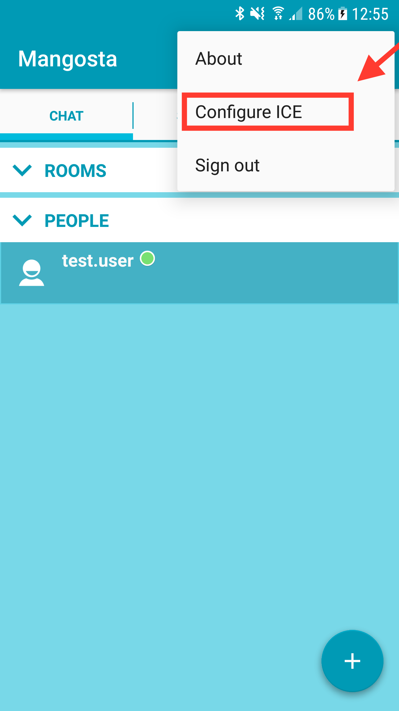

## How to: Setup fennec (TURN/STUN server) and see that it works (a.k.a ICE demo)

### Introduction
#### Who is that document for?

This document shows our TURN/STUN server in action. 
Not only shows how to setup and configure the [Fennec], but shows how to setup entire example system that takes advantage of what *Fennec* can do. 
Therefore this documents is for everyone that want to tinker with a real example of a application that requires NAT traversal and uses a TURN and STUN server to achieve it.

#### What will be the end result of this tutorial?

At the end of the tutorial you will get a working environment that includes two peers that are able to send live video stream to each other.
This peer-to-peer communication will not be obstructed with any NATs that may happen to be on the way. 
The live video stream is only an example here - there are many possible use cases for peer-to-peer communication with NAT transversal. 
We choose to build the example application that shows video streaming only because it is probably most "presentable" use case. 


#### What do I need to begin?

Before you begin you may need to prepare an environment for setting up the components used in this tutorial. 
To keep it short, here's a list of things you need to have:
* At least one Android phone (or at least an Android emulator). 
The video player in this tutorial in available only as Android application.
* RaspberryPi or virtually any device that is able to [run Elixir code][Elixir]. Oh, and also has [ffmpeg] installed.
In this tutorial we will use RaspberryPi 3 since it looks cool and it will be easier to distinguish this component from others since RaspberryPi as a name is much less common then "*generic device that runs elixir*". 
* At least one machine with public IPv4 address. 
You need this since, both [MongooseIM] and [Fennec] servers need to be accessible by all devices that are used in this demo system.
You could use some private, local IP address, but then you would need to ensure that your phone and the RaspberryPi are behind some kind of a NAT relatively to this IP address.
On this tutorial we are going to use 2 VPS (Virtual Private Server) that are based somewhere far far away and have a public IPv4 address each, that we will reference to as *1.1.1.1* for the Fennec's VPS and *2.2.2.2* for the MongooseIM's VPS. 
Also we will assume that there is a domain connected to *2.2.2.2* IP address called *myxmpp.com* since we are going to setup XMPP server on the VPS with this IP address.

#### General architecture of the environment build with this tutorial

The architecture of the system we are building looks like this:
![ICE example architecture][ice_architecture]

As stated in chapter above, we can see here [MongooseIM] at *2.2.2.2*/*myxmpp.com* and [Fennec] on *1.1.1.1*. 
We also have a RaspberryPi that is connected to some private network (so is behind some NAT) and Android Phone that is connected to LTE network that also is behind carrier's NAT.

#### ICE notes

The end result of this tutorial uses not only the [Fennec] and [MongooseIM] servers but also custom version of [Mangosta-Android] and [DemoStreamerICE].
Both projects are custom modified and custom made respectively in order to showcase the video steaming on top of the [Fennec] data relay. 
The streaming itself along with the signaling protocol are made only for this demo and **are not part of the platform**. 
Those components exist only to visualize what [Fennec] can achieve and what one can build on top of it. 


### Setting up MongooseIM (signaling)

The ICE is nothing without signaling. The signaling protocol itself can be designed specifically for the application that is being deployed or can be implemented based on some standards like e.g. [Jingle].
Here, since this is only an example that show [Fennec] in action we choose to implement simplest signaling possible - i.e. sending relay addresses via XMPP messages. 
No matter whether we would use this approach or [Jingle] we can use [MongooseIM] XMPP server as transport for this signaling. 
Therefore in order to enable signaling we need an instance of [MongooseIM] in the simplest configuration, since the only thing we need from [MongooseIM] is to provide us with means to communicate between two peers.

#### Configuration

TODO: describe MIM configuration or point to other docs to skip this section

#### Users

After we finish setting up [MongooseIM], we need to register some users. For this demo we need two: *movie@myxmpp.com* and *phone@myxmpp.com* for RaspberryPi and our Android phone respectively. 
In order to do that, we can simply type in the following on machine that has [MongooseIM] installed:

```bash
/usr/lib/mongooseim/bin/mongooseimctl register phone myxmpp.com xmpp_password
/usr/lib/mongooseim/bin/mongooseimctl register movie myxmpp.com xmpp_password
```

As you can see here, we have created those two users, both with password *xmpp_password* for simplicity. 

### Setting up Fennec (TURN/STUN server)

Now, since we have [MongooseIM] that can handle signaling, we need TURN relay and STUN server that will be used by peers to send peer-to-peer data. 
For that we are going to use the star of this tutorial - [Fennec]. 

#### How to get and configure

The whole documentation that describes all options and deployment methods, you can find on the [project's github page][Fennec]. 
Here we are going to just make it run (this command assumes we are on the server for [Fennec] and that it has docker installed):
```bash
docker run -it --net=host -e "FENNEC_UDP_RELAY_IP=1.1.1.1" -e "FENNEC_STUN_SECRET=secret" -e "FENNEC_UDP_REALM=myrelay" mongooseim/fennec:0.3.0
```

This command started [Fennec] server in docker while attaching its network interface to the real network interface of the machine we are running docker on. 
There are three important settings we have to set via environment variables:
* **FENNEC\_UDP\_RELAY\_IP** - This sets the IP address that [Fennec] is accessible on for data relay. 
This should be set to public IPv4 address that is able to pass-through UDP packets on all ports to [Fennec] server. 
* **FENNEC\_STUN\_SECRET** - This is a secret password that will be needed by TURN clients to connect to this server. 
It may be anything you will be also able to set on you Android phone, since the phone in this tutorial is going to need this TURN relay. 
* **FENNEC\_UDP\_REALM** - This is just a name for your TURN relay. 
It can be anything but it has to match when configuring TURN client, similar to the secret above.

And that's it! [Fennec] is now ready to roll!

### Setting up Mangosta-Android
#### How to get and install

The source code of the "video stream demo enabled" [Mangosta-Android] can be found on the [ice_demo_kt][mangosta_ice_demo] branch.
If you want to tinker with it and compile it yourself, you can do that. All you need is [Android Studio 2.3+](https://developer.android.com/studio/index.html).
The compilation is pretty straight forward, so I'm not going to explain it here. If you are interested in how it works, most of the code is in `inaka.com.mangosta.videostream` package.
If you don't want to compile this application from source, you can just install [this .apk](https://drive.google.com/file/d/0B48g-HBQ5xpxclQ2RnBFMUluRU0/view?usp=sharing) on your phone and that's it. 

#### How to configure 

Just after you run [Mangosta-Android] for the fist time, you will need to login into your XMPP server. 
In order to do that, just enter the JID you have created for the phone (*phone@myxmpp.com*), password (*xmpp_password*), the server address (*myxmpp.com* or *2.2.2.2*) and confirm by clicking "Enter".


After we log in, we can start setting up the connection to our [Fennec] server. The process is shown on the screen shoots below. 




On the "*Configure ICE*" screen we have to setup 5 fields: 
* **TURN server address** - IPv4 address of our [Fennec]
* **TURN Server port** - since we did not set the port while configuring [Fennec] it uses a default one - **3478**
* **TURN Realm** - Realm name we have set via *FENNEC\_UDP\_REALM* variable. In our case it's "*myrelay*".
* **TURN username** - Current version of [Fennec] ignores this, so you may leave it as is.
* **TURN password** - The password that we have set via *FENNEC\_STUN\_SECRET* variable. In out case it's "*secret*"

And that would be all. Now you can click "*TEST CONNECTEION*" to, well... test the connection. 
If everything works, you can "*SAVE*" the settings. Now you [Mangosta-Android] is ready to play streamed video, but we still need the source...

### Setting up RaspberryPi

So now let's configure the video source. In our case it will be RaspberryPi with [Elixir] and [ffmpeg] installed running [our ICE demo application][ice_demo_client].

#### The software

For this demo we provide simple XMPP client that also is able to send live video stream using [ffmpeg] whenever other peer asks for it via XMPP. 
This client is written in [Elixir], so we can run it from source quite easily. 

#### How to get and configure

You can get the client's sources [here][ice_demo_client]. But for now we only need to run it, so let's get to it (on our RaspberryPi):
```bash
git clone https://github.com/esl/ice_demo.git
cd ice_demo
mix deps.get
iex -S mix
```

After a while we should get into Elixir's shell. In order to enable the streamer we need to start it while providing it with some options (in Elixir's shell we have just started):
```elixir
opts = [
  jid: "movie@myxmpp.com",
  password: "xmpp_password",
  host: "myxmpp.com",
  turn_addr: "1.1.1.1:3784"
  turn_username: "username",
  turn_secret: "secret",
  video_file: "/home/pi/sintel.h264"
]
ICEDemo.start_movie(opts)
```

The first 3 options are all about connection to our XMPP server - we use "*movie@myxmpp.com*" user that we created earlier. 
Next 3 options are about connection to the [Fennec] server. 
Those are similar to ones we set in [Mangosta-Android]. 
The last one points to the video file that will be streamed on request. This file has be a raw H.264 video-only file.
If you are not sure how to get one, you can just use [this one][h264_sample_video] (pre-rendered [Sintel, OpenBlender project](https://durian.blender.org/)). 
After this configuration, out RaspberryPi is ready to stream!

### The end result
#### Playing the video

Now we finally can get out phone and start streaming the video! 
In order to do that, we have to click the "*New video stream*" button as shown on the screen shoots below, enter the JID of the RaspberryPi and confirm with "*Stream!*" button. 


Hopefully you can see the video now on your phone :)

[Fennec]: https://github.com/esl/fennec
[MongooseIM]: https://github.com/esl/MongooseIM
[Mangosta-Android]: https://github.com/esl/mangosta-android
[mangosta_ice_demo]: https://github.com/esl/mangosta-android/tree/ice_demo_kt
[Jingle]: https://xmpp.org/extensions/xep-0166.html
[ice_architecture]: ice_tutorial_resources/ice_architecture.png
[Elixir]: https://elixir-lang.org/install.html
[ffmpeg]: https://ffmpeg.org
[ice_demo_client]: https://github.com/esl/ice_demo
[h264_sample_video]: https://drive.google.com/file/d/0B48g-HBQ5xpxeVlUSks2bVRlLTQ/view?usp=sharing
