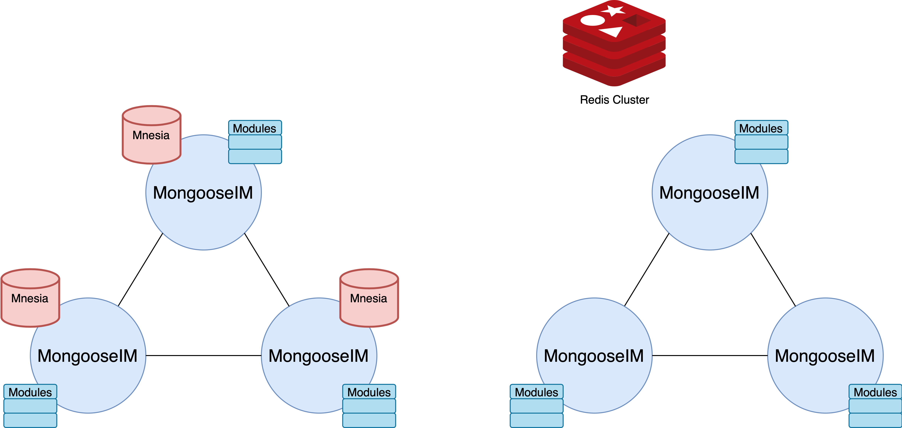

## Inside MongooseIM

### Modules

At its core MongooseIM is a huge message router you can customise to fit your system's needs.
You can choose and enable behaviours and functionalities by configuring any of the available modules.
A wide range of options includes authentication, privacy, storage, backend integration and mobile optimisations.
See '[Extension Modules](../advanced-configuration/Modules.md)' for a full list.

Modules can be configured and started either for all virutal hosts served by the instance or with individual configuration for only some of them.
Modules may include dependencies on services and on other modules.
If a module depends on other modules, required modules are started automatically with configuration provided by the dependent module.
If a module requires certain services which are not started, the module refuses to start.

### Services

Services provide certain functionalities not specific to virtual hosts but rather applied to the whole instance or to modules started for various hosts.
They are configured globally and launched on startup, before modules, so that dependencies are satisfied.
A service can require other services to be operational; required services are started automatically.
The required service must also be present in the server's configuration file.
They were introduced in MongooseIM 2.2; modules which are not host-specific are gradually being refactored as services.

### Databases

MongooseIM manages two sets of data: transient for session data management, and persistent for archive and configurations.

Please refer to '[Database Backends](../advanced-configuration/database-backends-configuration.md)' doc for more configuration information.

#### Transient databases

In the MongooseIM architecture each MongooseIM node host has an accompanying Mnesia node. 

Redis on the other hand forms a separate cluster and does not utilise MongooseIM nodes. 

There is no need to set up any backups for transient data since it naturally rebuilds as clients reconnect massively.

#### Persistant databases

Both RDBMS/SQL (MySQL/PostgreSQL) and NOSQL (Riak KV) databases are supported.

Backups should be regular, and tested.

#### LDAP directory

LDAP will also run on a separate cluster.

Backups should be regular, and tested.

## Outside MongooseIM: ecosystem in a datacenter

### Frontend

Native clients on platforms such as Android, iOS, Windows, Linux, macOS, will preferrably use a plain XMPP over TCP connections.

Since web clients cannot use TCP connections, they will preferrably use XMPP over websockets, or the now less relevant XMPP over BOSH (using long-lived HTTP connections, more and more used as fallback).

Any client could use the client REST API, which is using HTTP request/responses.

All these client connections will hit a frontend load balancer before reaching the MongooseIM cluster.

### Backend

MongooseIM supports bilateral communication with other backend services in the datacenter infrastructure.

MongooseIM REST API is available for control/management of MongooseIM's operations as well as the functional aspects.

An HTTP notification enables forwarding of the events to any other external HTTP service.

### Management and monitoring

WombatOAM enables the monitoring and management of MongooseIM clusters, as well as Riak KV, RabbitMQ, and any other Erlang and Elixir based system.

### MongooseICE (STUN/TURN)

Contact us.

### MongoosePush (APNS, GCM)

Available on: [MongoosePush](https://github.com/esl/MongoosePush)

## MongooseIM in a worldwide, multi-datacenter configuration

The MongooseIM platform enables a service to scale worlwide, with proximity servers across continents and datacenters. It leverages the use of the open standard S2S (server-to-server) protocol.

Contact us.
