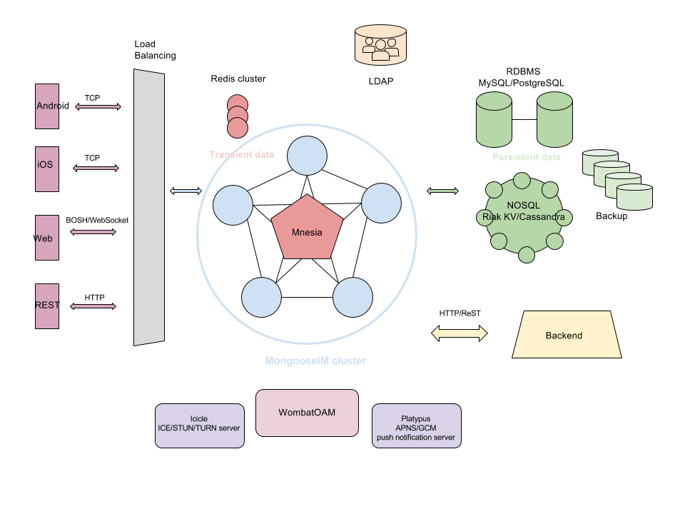

## Inside MongooseIM

MongooseIM is basically a huge router, that comes with a large set of modules. These modules modify and extend the behaviour and features of MongooseIM. Sysadmins and DevOps can configure these modules and potentially enable them. W wide range of modules are available, such as authentication, privacy, storage, backend integration, mobile optimisations... See '[Extension Modules](../advanced-configuration/Modules.md)' for more info.

For a reminder, MongooseIM manages two sets of data: transient for session data management, and persistent for archive and configurations.

## Outside MongooseIM: ecosystem in a datacenter

### Databases

Please refer to '[Database Backends](../advanced-configuration/database-backends-configuration.md)' doc for more configuration information.

#### Transient databases

Mnesia will run on the same nodes as MongooseIM.

Redis will be a separate cluster, not using the same nodes as MongooseIM.

No need to backup here, since the transient data naturally rebuilds as clients reconnect massively.

#### Persistant databases

Both RDBMS (SQL) and NOSQL (Riak KV, Cassandra) 

Backups should be regular, and tested.

#### LDAP

LDAP will also run on a separate cluster.

Backups should be regular, and tested.

### Frontend

Native clients, on platforms such as Android, iOS, Windows, Linux, macOS, will preferrably use a plain XMPP over TCP connections.

Web clients will preferrably use XMPP over websockets, or the now less relevant XMPP over BOSH (using long-lived HTTP connections, more and more used as fallback) because web clients cannot use TCP connections.

Any client could use the client REST API, which is using HTTP request/responses.

All these client connections will hit a frontend load balancer before reaching the MongooseIM cluster.

### Backend

MongooseIM can communicate both ways with other backend services in the datacenter infrastructure.

The MongooseIM REST API is available for control/management of MongooseIM's operations as well as functional aspects.

A HTTP notification enables the forwarding of events to any other external HTTP service.

### Management and monitoring

WombatOAM enables the monitoring and management of MongooseIM clusters, as well as Riak KV, RabbitMQ, and any other Erlang and Elixir based system.

### ICE server (STUN/TURN)

Contact us.

### Mobile Push Notifications (APNS, GCM)

Contact us.

## MongooseIM in a worldwide, multi-datacenter configuration

The MongooseIM platforms enables a service to scale worlwide, with proximity servers across continents and datacenters. It leverages the use of the open standard S2S (server-to-server) protocol.

Contact us.
