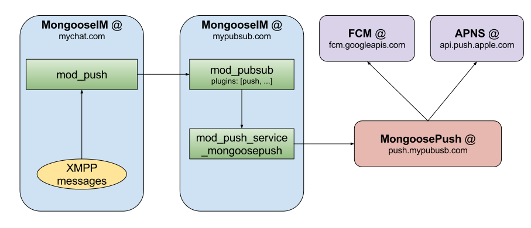
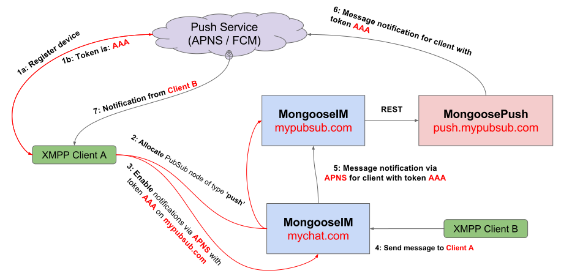

## Push Notifications

MongooseIM server supports push notifications using FCM (**F**irebase **C**loud **M**essaging)
and APNS (**A**pple **P**ush **N**otification **S**ervice) providers. Server side push
notification support is fully compliment with [XEP-0357 Push Notifications][XEP-0357], which defines several components that need to work together in order to provide clients
with working push notifications. The following list shows those components as defined in
[XEP-0357][] and MongooseIM components that correspond to those entities:
  * _XMPP Server_ in _MongooseIM_ is enabled by module [mod_push][]
  * _App Server_ in _MongooseIM_ is enabled by adding `node_push` node type to [mod_pubsub][]'s configuration
  * _XMPP Push Service_ is implemented as [MongoosePush][] application

All those entities have to be enabled and properly configured in order to use push notifications.
 So let's get it, shall we?

### Overall component architecture

The overall architecture of all components that make push notifications possible in MongooseIM, looks as follows:


Please note that even that, there are two domains of _MongooseIM_ and third one for [MongoosePush][], it is not required. All those 3 components can be on the same host with the same domain. 

### Configuring MongooseIM components

Firstly, let's configure all required MongooseIM components, step by step.

#### [mod_push][] a.k.a. '_XMPP Server_'

The first component that we need to configure in MongooseIM is [mod_push][] module. This module directly communicates with XMPP clients in order to enable/disable notifications on per-client basis.

The [mod_push][] module is very easy to enable - just paste in your MongooseIM configuration file:

 ```Erlang
{mod_push, [
    {wpool, [{workers, 100}]}
]}.
 ```

And that's basically it. You have just enabled push notification support with 100 asynchronous
workers that will handle all push notification's related work.

This is of course unless you need more robust control over the format of push notifications or state of user's sessions that may get those notifications, in which case you need to implement plugin module that implements
`mod_push_plugin` behaviour and enable this plugin as specified in [mod_push][] documentation.

#### [mod_pubsub][] with [mod_push_service_mongoosepush][] a.k.a. '_App Server_'

Next component to configure in MongooseIM consist of two modules - [mod_pubsub][] with `push` node type enabled that will act as sink for push notifications generated by [mod_push][] and [mod_push_service_mongoosepush][] - connector to [MongoosePush][] application.

##### [mod_pubsub][]'s `push` node

According to [XEP-0357 Push Notifications](https://xmpp.org/extensions/xep-0357.html), all
notifications generated via module we have just enabled (i.e. [mod_push][]) have to be send to push
 enabled publish-subscribe node. In order to allow clients to allocate such node, we need to
 enable it in our [mod_pubsub][] on the MongooseIM server that will communicate with _XMPP Push Service_.

The minimal [mod_pubsub][]'a configuration looks as follows:

```Erlang
{mod_pubsub, [
    {plugins, [<<"push">>]}}
]}.
```

Such configuration will enable [mod_pubsub][] with only one node type available: `push`. Please
note that if you want use [mod_pubsub][] as 'normal' publish-subscribe service, you need to just append
`<<"push">>` node type to list `plugins`. Also, it's important to node, that the first node type
on `plugins` list, will be the default one (allocated when client does not provide node type in
node create stanza).

##### [mod_push_service_mongoosepush][]

This module acts as bridge between [mod_pubsub][] that receives notifications from [mod_push][] and passes those to [MongoosePush][] which sends them to _FCM_ and/or _APNS_. To enable this module type in your configuration:

```Erlang
{http_connections, [{mongoose_push_http,
    [{server, "https://localhost:8443"}]
}]}.

{mod_push_service_mongoosepush, [
    {pool_name, mongoose_push_http}
    {api_version, "v1"}
]}.
```

First, we create the HTTP pool for communicating with [MongoosePush][]. Here, we assume that
[MongoosePush][] will be available on localhost on port 8443 which is the default one.
Next we enable [mod_push_service_mongoosepush][]. First option is a name of the HTTP pool to use
and the second one is a version of [MongoosePush][]'s API (currently only "_v1_" is supported).

And that's it, thats the end of MongooseIM configuration. All we need to do now is to set up
[MongoosePush][].

### Starting [MongoosePush][]

The easiest way to start [MongoosePush][] is using its [docker image](https://hub.docker.com/r/mongooseim/mongoose-push). But before you can set up [MongoosePush][], you need _FCM_ application token and/or _APNS_ application certificate. The _FCM_ token you can get [here](https://console.firebase.google.com/) and the easiest way of getting _APNS_ application certificate is by running [this](https://github.com/fastlane/fastlane/tree/master/pem) script (please note that you need certificate in `pem` format).

After you get the _FCM_ application token and/or _APNS_ application certificate, you can prepare to start [MongoosePush][]. Firstly, prepare the following files structure:

  * priv/
    * ssl/
      * rest_cert.pem - The REST endpoint certificate
      * rest_key.pem - private key for the REST endpoint certificate
    * apns/
      * prod_cert.pem - Production APNS app certificate
      * prod_key.pem - Production APNS app certificate's private key
      * dev_cert.pem - Development APNS app certificate
      * dev_jey.pem - Development APNS app certificate's private key

Assuming that your _FCM_ app token is `MY_FCM_SECRET_TOKEN` and you have the `priv` directory with all ceriticates in current directory, then you may start MongoosePush with the following command:

```bash
docker run -v `pwd`/priv:/opt/app/priv \
  -e PUSH_FCM_APP_KEY="MY_FCM_SECRET_TOKEN" \
  -e PUSH_HTTPS_CERTFILE="ssl/rest_cert.pem" \
  -e PUSH_HTTPS_KEYFILE="ssl/rest_key.pem" \
  -it --rm mongooseim/mongoose-push:latest
```

If you don't want to use either _APNS_ or _FCM_, you simply need to pass `PUSH_APNS_ENABLED=0` or `PUSH_FCM_ENABLED=0` respectively as additional env variables in your `docker run` command. For more advanced options and configuration
please refer to _"Quick start / Configuring"_ in [MongoosePush][]'s [_README.md_][MongoosePushReadme].

When your [MongoosePush][] docker is up and running, Push Notifications now can be used in your MongooseIM instance.

## Using push notifications on client side

The XMPP client application has very few things to do in order to receive push notifications. The whole process described in this section along with example notification flow we can see in the following diagram:
 

### Registering with Push Service provider

Firstly, client application has to get a device-specific token from Push Service Provider (FCM or APNS). This process is different, depending on the platform, so please consult your Push Service Provider's manual to learn about how to get this token. For example, [here](https://firebase.google.com/docs/cloud-messaging/android/client) you can learn about setting up _FCM_ on _Android_ platform and [here](https://developer.apple.com/library/content/documentation/NetworkingInternet/Conceptual/RemoteNotificationsPG/HandlingRemoteNotifications.html#/apple_ref/doc/uid/TP40008194-CH6-SW1) you can learn about setting up _APNS_ on _iOS_ platform.

After this step, your application shall be able to receive _FCM_ or _APNS_ token - it will be required in the next step of this tutorial.

### Setting up XMPP `pubsub` node

First thing that the clinet has to set up on XMPP server is the `PubSub`'s node for handling push notifications. Assuming that `mypubsub.com` is a domain of MongooseIM server that has [mod_pubsub][] enabled with `push` node support, the client shall send the following stanza to the server:

```xml
<iq type='set'
    from='me@mongooseim.com'
    to='pubsub.mypubsub.com'
    id='create1'>
  <pubsub xmlns='http://jabber.org/protocol/pubsub'>
    <create node='princely_musings' type='push'/>
  </pubsub>
</iq>
```

Here, the most important and only change from standard node creation is the `type='push'` part of `create` element. This denotes that you need node that will handle your push notifications. Here, created is named `princely_musings`. This node should be unique to the device and you may reuse nodes already created this way.

After this step, you need to have the `pubsub` host (here `pubsub.mypubsub.com`) and the node name (here: `princely_musings`).

### Enabling push notifications

The next and the last step is to enable push notifications on the server that handles your messages (and have [mod_push][] enabled). Let's assume this server**** is available under `mychat.com` domain.

To enable push notifications in the simplest configuration, just send the following stanza:

```xml
<iq type='set' id='x43'>
  <enable xmlns='urn:xmpp:push:0' jid='pubsub.mypubsub.com' node='princely_musings'>
    <x xmlns='jabber:x:data' type='submit'>
      <field var='FORM_TYPE'><value>http://jabber.org/protocol/pubsub#publish-options</value></field>
      <field var='service'><value>apns</value></field>
      <field var='device'><value>your_pns_device_token</value></field>
    </x>
  </enable>
</iq>
```

Here, we have enabled push notification to be send to the `pubsub.mypubsub.com` to node `princely_musings` which we have created in previous paragraph. In `publish-options` we have passed the service name that we are using (`apns` or `fcm`) and the device token (here: `your_pns_device_token`) that you received from you push notification service provider (as described in _Registering with Push Service provider_). Those two options are only required, but there are two more that are optional:
  * `mode` - which may be either `prod` or `dev` (default to `prod`). Decides which connection pool type on [MongoosePush][] shall be used. This may be used when _APNS_ on [MongoosePush][] is configured to work with both production and development certificate.
  * `click_action` - action to perform when notification is clicked on the device. `activity` on _Android_ and `category` on _iOS_. Please refer to your platform / push notification service provider for more info.

### Disabling push notifications

Disabling push notifications is very simple. Just send the following stanza to your XMPP chat server:

```xml
<iq type='set' id='x44'>
  <disable xmlns='urn:xmpp:push:0' jid='pubsub.mypubsub.com' node='princely_musings'/>
</iq>
```

Here you may skip the `node='princely_musings'` to globally disable push notifications on all nodes that are registered from you `JID`. This may be used to disbale push notifications on all your devices.

[mod_push]: ../modules/mod_push.md
[mod_pubsub]: ../modules/mod_push.md
[mod_push_service_mongoosepush]: ../modules/mod_push_service_mongoosepush.md
[MongoosePush]: htps://github.com/esl/MongoosePush
[MongoosePushReadme]: https://github.com/esl/MongoosePush/blob/master/README.md
[XEP-0357]: https://xmpp.org/extensions/xep-0357.html
