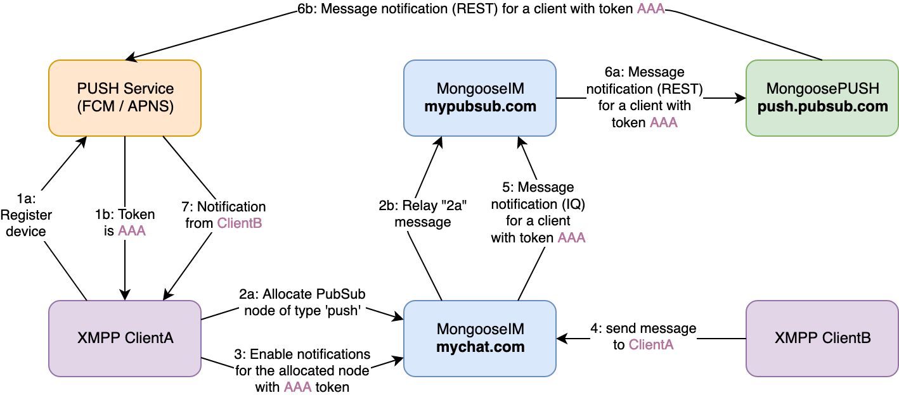
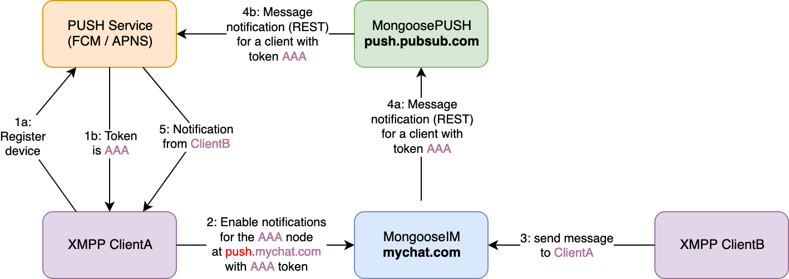

## Using push notifications on the client side

There are just a few things the XMPP client application needs to receive the push notifications.
Depending on whether you plan to use PubSub-full or PubSub-less configuration, some of the steps may be unnecessary.

### Registering with a Push Service provider

First, the client application has to get a device-specific token from the Push Service Provider
(FCM or APNS). This process is different, depending on the platform, so please consult your Push
Service Provider's manual to see how to get this token. For example,
[here](https://firebase.google.com/docs/cloud-messaging/android/client) you can learn about setting
up _FCM_ on _Android_ platform and
[here](https://developer.apple.com/library/content/documentation/NetworkingInternet/Conceptual/RemoteNotificationsPG/HandlingRemoteNotifications.html#/apple_ref/doc/uid/TP40008194-CH6-SW1)
you can learn about setting up _APNS_ on _iOS_ platform.

After this step, your application shall be able to receive _FCM_ or _APNS_ token - it will be
required in the next step of this tutorial.

### Setting up an XMPP `pubsub` node

This step is specific to the PubSub-full push configuration that you chose for your MongooseIM
server. If you're running a PubSub-less configuration, skip to [this point](#enabling-push-notifications).

#### Creating a new push node
In this example `mypubsub.com` is a domain of the MongooseIM server that has [mod_pubsub][] enabled
with the `push` node support. The client sends the following stanza to the server:

```xml
<iq type='set'
    to='pubsub.mypubsub.com'
    id='create1'>
  <pubsub xmlns='http://jabber.org/protocol/pubsub'>
    <create node='punsub_node_for_my_private_iphone' type='push'/>
    <configure>
      <x xmlns='jabber:x:data' type='submit'>
        <field var='FORM_TYPE' type='hidden'>
          <value>http://jabber.org/protocol/pubsub#node_config</value>
        </field>
        <field var='pubsub#access_model'>
          <value>whitelist</value>
        </field>
        <field var='pubsub#publish_model'>
          <value>publishers</value>
        </field>
      </x>
    </configure>
  </pubsub>
</iq>
```

The `pubsub.mypubsub.com` will be used as a gateway for all notifications
and will pass them through to the APNS and/or FCM.

The most important and only difference from the standard node creation
is the `type='push'` part of the `create` element.
According to [XEP-0357](https://xmpp.org/extensions/xep-0357.html#enabling), a PubSub node is
required to route the push notification mechanism. This implies you need a node that will handle
your push notifications, hence we create a node called `punsub_node_for_my_private_iphone`.
This node should be unique to the device and you may reuse nodes already created this way.
The token obtained from _APNS_ or _FCM_ is a good option to ensure this uniqueness,
by either using it directly or within some custom node name generation.
It is also important from the security perspective to configure the node with:

* `access_model` set to `whitelist` so only affiliated users can access the node.
* `publish_model` set to `publishers` so only users with `publisher` or `publisher_only` role
can publish notifications.

#### Adding the server's JID to allowed publishers

Push notifications to the push node are addressed from your server's JID.
If the push node was configured with the above recommended options, you need to allow your server's
JID to publish notifications to that node.
Considering your JID is `alice@mychat.com`, your server's JID is just `mychat.com`.
The following stanza sent to the just created push node will allow your server JID to publish notifications:

```xml
<iq to='pubsub.mypubsub.com'
    type='set'
    id='wy6Hibg='
    from='alice@mychat.com/resource'>
	<pubsub xmlns='http://jabber.org/protocol/pubsub#owner'>
		<affiliations node='punsub_node_for_my_private_iphone'>
			<affiliation jid='mychat.com' affiliation='publish-only'/>
		</affiliations>
	</pubsub>
</iq>
```

### Enabling push notifications

The next and the last step is to enable push notifications on the server that handles your messages
(and has [mod_event_pusher_push][] enabled).
Let's assume this server is available under the domain `mychat.com`.

To enable push notifications in the simplest configuration, just send the following stanza:

```xml
<iq type='set' id='x43'>
  <enable xmlns='urn:xmpp:push:0' jid='pubsub.mypubsub.com' node='punsub_node_for_my_private_iphone'>
    <x xmlns='jabber:x:data' type='submit'>
      <field var='FORM_TYPE'><value>http://jabber.org/protocol/pubsub#publish-options</value></field>
      <field var='service'><value>apns</value></field>
      <field var='device_id'><value>your_pns_device_token</value></field>
      <field var='silent'><value>false</value></field>
      <field var='topic'><value>some_apns_topic</value></field>
      <field var='priority'><value>some_priority</value></field>
    </x>
  </enable>
</iq>
```

We have now enabled push notifications to be send to the `pubsub.mypubsub.com` domain
on the node `punsub_node_for_my_private_iphone` created previously, or in the case of PubSub-less,
for whatever unique node name we give here, for example any variation of the token obtained from
_APNS_ or _FCM_. In `publish-options` we have passed the service name we are using (`apns` or `fcm`)
and the device token (here: `your_pns_device_token`) that you received from your push notification
service provider (as described in [Registering with Push Service provider](#registering-with-a-push-service-provider)).
Those two options are the only ones required, but there are some others that are optional:

  * `mode` - which may be either `prod` or `dev` (default to `prod`). Decides which connection pool
    type on [MongoosePush][] shall be used. This may be used when _APNS_ on [MongoosePush][] is
    configured to work with both production and development certificate.
  * `click_action` - action to perform when notification is clicked on the device. `activity` on
    _Android_ and `category` on _iOS_. Please refer to your platform / push notification service
    provider for more info.
  * `topic` - currently only used with _APNS_. The value is passed to _APNS_ as `topic` header.  For
    more information please refer to _APNS_ documentation.
  * `silent` - if set to `true`, all notifications will be "silent". This means that only the data
    payload will be send to the push notifications provider with no notification. The data payload
    will contain all notification fields as defined in [XEP-0357].
  * `priority` — which may be either `normal` or `high`, and if not given, defaults to `normal`.
    This value will set the push notification priority. Please refer to FCM / APNS documentation for
    more details on those values.

### Disabling push notifications

Disabling push notifications is very simple. Just send the following stanza to your XMPP chat server:

```xml
<iq type='set' id='x44'>
  <disable xmlns='urn:xmpp:push:0' jid='pubsub.mypubsub.com' node='punsub_node_for_my_private_iphone'/>
</iq>
```

You may skip the `node='punsub_node_for_my_private_iphone'` to globally disable push notifications
on all nodes that are registered with your `JID`.
This may be used to disable push notifications on all your devices.

### Communication overview

One picture is worth a thousand words, so here are two diagrams
showing the typical communication when using push notifications:

#### PubSub-full:

 

#### PubSub-less:

 

[mod_event_pusher_push]: ../../modules/mod_event_pusher_push.md
[mod_pubsub]: ../../modules/mod_pubsub.md
[mod_push_service_mongoosepush]: ../../modules/mod_push_service_mongoosepush.md
[MongoosePush]: https://github.com/esl/MongoosePush
[MongoosePushReadme]: https://github.com/esl/MongoosePush/blob/master/README.md
[XEP-0357]: https://xmpp.org/extensions/xep-0357.html
