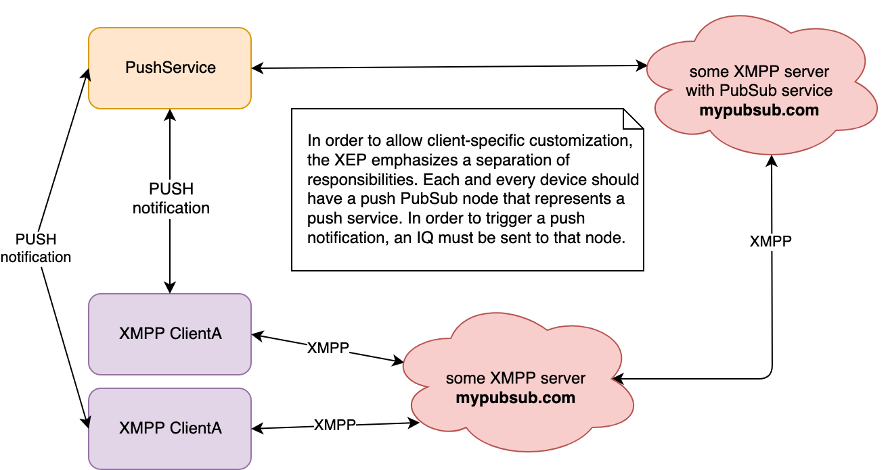
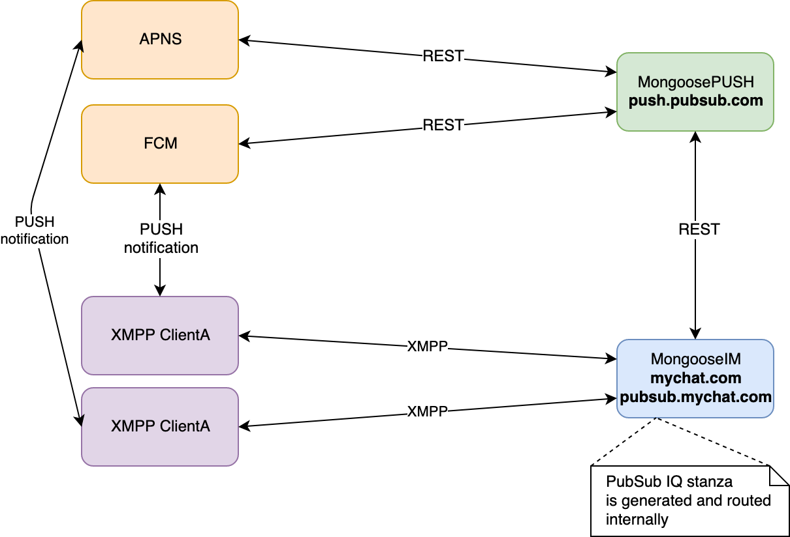
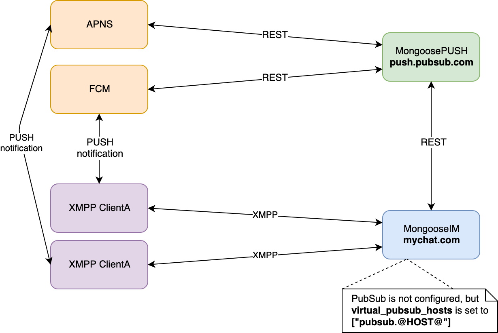
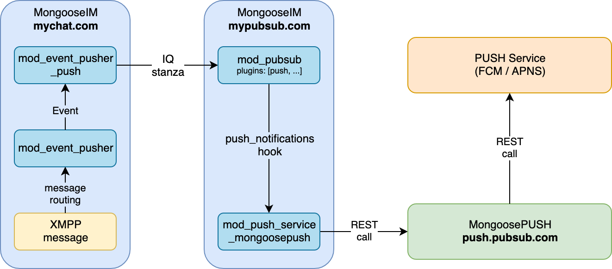
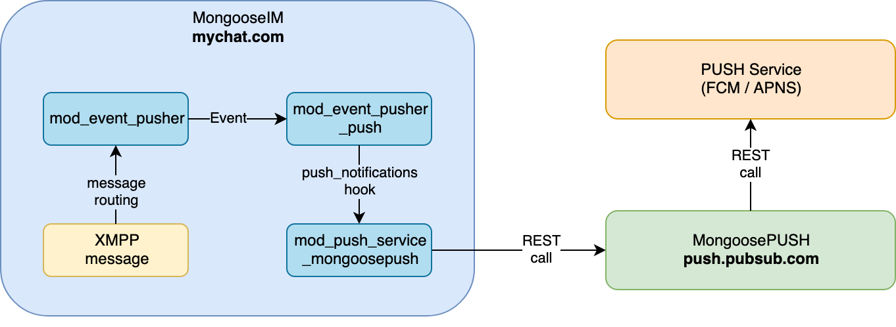

## How to set up Push Notifications

Push notifications are the bread and butter of the modern mobile experience, and MongooseIM has
support for them. When used together with [MongoosePush][], you get out-of-the-box push
notifications for FCM (**F**irebase **C**loud **M**essaging) and APNS (**A**pple **P**ush
**N**otification **S**ervice) providers. And it's easy to extend it to any other protocols of your
choice.

You might also want to read about the push notification's [client side configuration][client-side].

All push notification mechanisms use [mod_event_pusher_push][] as a backend implementation,
read [the relevant documentation][mod_event_pusher] to know more about it.

### [XEP-0357 Push Notifications][XEP-0357]

Server side push notification support is fully compliant with [XEP-0357 Push Notifications][XEP-0357],
which defines several components that need to work together in order to provide clients with working
push notifications. However, there's just one non-optimal detail required by the aforementioned XEP:
that push notifications being a PubSub service — [we can do better than that][pubsub-less].

If you're already familiar with the workings of [XEP-0357][], make sure to have a look at
[our PubSub-less enhancement][pubsub-less].

As it is always said, one picture is worth a thousand words:

 

Who does what is highly configurable. You may use MongooseIM as the XMPP server clients connect to,
and send the push XMPP stanzas to a different server that will take care of the push business;
or you might use MongooseIM as the remote XMPP-PubSub server that does such business. Note that the
XEP doesn't enforce the push IQ stanza format, so whichever setup is used, you need to take care of
the producing and processing of these stanzas.

You might also use MongooseIM as both, or you might even do both things within a single MongooseIM
node (the most common setup!). Or, for the best performance, you might just skip that PubSub node
altogether. While the whole setup can be incredibly extensible, we see the following straightforward
uses of it.

### XEP-0357 compliant with local PubSub

 

This is, historically, the most common setup.
It allows your clients to enable push notifications via a local PubSub,
and the IQ stanza is routed internally.

A direct connection to a push service (e.g. MongoosePush) must be configured on the same MongooseIM
node. Check out [this][WithMongoosePush] tutorial on how to setup [MongoosePush][].

```erlang
{mod_pubsub, [{plugins, [<<"push">>]}]}, % mandatory minimal config
{mod_event_pusher, [
    {backends, [
        {push, [
            {backend, mnesia}, % optional
            {wpool, [{workers, 200}]}, % optional
            {plugin_module, mod_event_pusher_push_plugin_defaults} % optional
        ]}
    ]}
]}
```

#### Advantages
* Completely XEP-0357 compliant, and therefore compatible with any compliant 3rd party client library
* No need to have two different servers

#### Drawbacks
* Less efficient (PubSub has a considerable impact on heavily loaded systems)
* More load within a single node
* Harder to customise

### MongooseIM as a PubSub-less XMPP server

 

PubSub is completely bypassed and clients don't need to create a push node — if they attempt to
do so, and PubSub is not configured, the server would respond with an error stanza.
They only have to provide the virtual PubSub address in the enable stanza, and node name can be
anything unique. In order to ensure uniqueness the APNS/FCM token can be used. Note that the token
must be provided [as a publish option](https://xmpp.org/extensions/xep-0357.html#example-9) anyway.

A direct connection to a push service (e.g. MongoosePush) must be configured on the same MongooseIM
node. Check out [this][WithMongoosePush] tutorial on how to setup [MongoosePush][].

```Erlang
{mod_event_pusher, [
    {backends, [
        {push, [
            {backend, mnesia}, % optional
            {wpool, [{workers, 200}]}, % optional
            {plugin_module, mod_event_pusher_push_plugin_defaults}, % optional
            {virtual_pubsub_hosts, ["virtual.@HOSTS@"]}
        ]}
    ]}
]}
```

#### Advantages
* No need to use PubSub at all
* More efficient (PubSub has a considerable impact on heavily loaded systems)
* Simpler client-side usage — Read about the [client side configuration here][client-side]

#### Drawbacks
* If the client application is built to create the push PubSub node, this might require a migration
  for such client — as he attempts to create the node, the server will answer with an IQ error
  stanza. If migrating the client side is a problem, there's a solution for that
  [in the module section][mod_event_pusher_push_plugin]

#### Virtual PubSub hosts

These domains will shadow any identical domain configured for PubSub, stealing any notification
published to it. It enables easy migration from PubSub-full deployments to PubSub-less variants.
Read more in [the relevant section][mod_event_pusher_push_virtual_hosts].


## Overview of all the involved MongooseIM components

The components that make push notifications possible in MongooseIM
comprise the following architecture:

PubSub-full setup | PubSub-less setup
:-:|:-:
 | 


#### [mod_event_pusher_push][]

The first component that we need to configure in MongooseIM is the [mod_event_pusher_push][] module.

#### [mod_push_service_mongoosepush][]

A connector to [MongoosePush][] application. You can read more about it [here][WithMongoosePush].

##### [mod_pubsub][]'s `push` node

According to the [XEP-0357 Push Notifications](https://xmpp.org/extensions/xep-0357.html), all
notifications generated via the module we have just enabled (i.e. [mod_event_pusher_push][]) have to
be send to a push enabled publish-subscribe node. In order to allow clients to allocate such a
node, we need to enable it in our [mod_pubsub][] on the MongooseIM server that will communicate with
the _XMPP Push Service_.

[pubsub-less]: #mongooseim-as-a-pubsub-less-xmpp-server
[client-side]: ./Push-notifications-client-side.md
[mod_event_pusher]: ../../modules/mod_event_pusher.md
[mod_event_pusher_push]: ../../modules/mod_event_pusher_push.md
[mod_event_pusher_push_plugin]: ../../modules/mod_event_pusher_push.md#plugin-module
[mod_event_pusher_push_migration]: ../../modules/mod_event_pusher_push.md#migration-from-xep-0357-to-virtual-hosts
[mod_event_pusher_push_virtual_hosts]: ../../modules/mod_event_pusher_push.md#virtual-pubsub-hosts
[mod_pubsub]: ../../modules/mod_pubsub.md
[mod_push_service_mongoosepush]: ../../modules/mod_push_service_mongoosepush.md
[MongoosePush]: https://github.com/esl/MongoosePush
[WithMongoosePush]: ./With-MongoosePush.md
[MongoosePushReadme]: https://github.com/esl/MongoosePush/blob/master/README.md
[XEP-0357]: https://xmpp.org/extensions/xep-0357.html
[federation]: ../../../advanced-configuration/Listener-modules/#server-to-server-s2s-ejabberd_s2s_in
